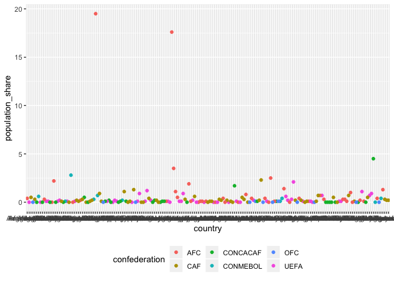

### \#TidyTuesday - Week 11 data

The data for week 11 can be found
[here](https://github.com/rfordatascience/tidytuesday/blob/master/data/2018-06-12/week11_fifa_audience.csv).
It’s FIFA audience data.

``` r
library(tidyverse)

data <- read_csv("fifa.csv")
```

    ## Warning: Missing column names filled in: 'X1' [1]

    ## Parsed with column specification:
    ## cols(
    ##   X1 = col_integer(),
    ##   country = col_character(),
    ##   confederation = col_character(),
    ##   population_share = col_double(),
    ##   tv_audience_share = col_double(),
    ##   gdp_weighted_share = col_double()
    ## )

``` r
head(data)
```

    ## # A tibble: 6 x 6
    ##      X1 country confederation population_share tv_audience_sha…
    ##   <int> <chr>   <chr>                    <dbl>            <dbl>
    ## 1     1 United… CONCACAF                   4.5              4.3
    ## 2     2 Japan   AFC                        1.9              4.9
    ## 3     3 China   AFC                       19.5             14.8
    ## 4     4 Germany UEFA                       1.2              2.9
    ## 5     5 Brazil  CONMEBOL                   2.8              7.1
    ## 6     6 United… UEFA                       0.9              2.1
    ## # ... with 1 more variable: gdp_weighted_share <dbl>

From the head() command, we can see there are six columns: X1 (no name
in orginal file), country, confederation, population share, tv audience
share, gdp weighted share.

First, let’s clean up the data just a bit. We don’t need the first
column (X1). It’s more than likely row numbers left over from the
original data source. You can use the select() command to keep columns
of interest by name. If you put a minus sign (-) in front of the column
name, it drops that column from the tibble. Let’s drop the first column
& save the cleaner tibble to a new object.

``` r
data1 <- data %>%
  select(-X1)

head(data1)
```

    ## # A tibble: 6 x 5
    ##   country confederation population_share tv_audience_sha… gdp_weighted_sh…
    ##   <chr>   <chr>                    <dbl>            <dbl>            <dbl>
    ## 1 United… CONCACAF                   4.5              4.3             11.3
    ## 2 Japan   AFC                        1.9              4.9              9.1
    ## 3 China   AFC                       19.5             14.8              7.3
    ## 4 Germany UEFA                       1.2              2.9              6.3
    ## 5 Brazil  CONMEBOL                   2.8              7.1              5.4
    ## 6 United… UEFA                       0.9              2.1              4.2

Using the head() command, we can see the first column was removed from
the tibble.

``` r
ggplot(data1, aes(country, population_share)) +
  geom_point(aes(color = confederation)) +
  theme(legend.position="bottom")
```

<!-- -->
