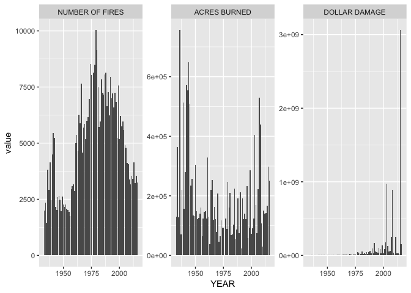
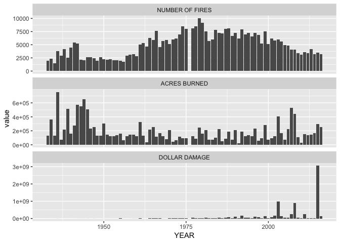
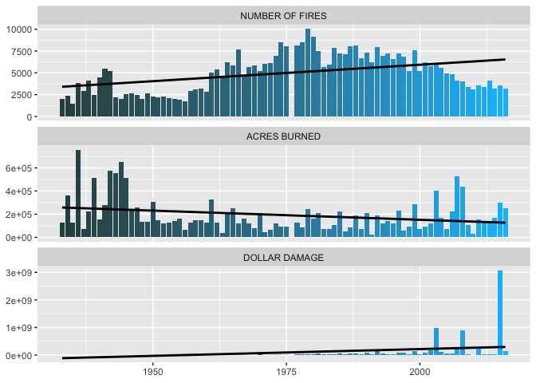

### \#TidyTuesday 8-21-18

We’re going to start by exploring the cal.fire.incidents.csv file from
this week’s Tidy Tuesday.

First, we need to load the data into R. I downloaded the .csv file from
the [Github
page](https://raw.githubusercontent.com/rfordatascience/tidytuesday/master/data/2018-08-21/cal-fire-incidents.csv)
& saved it as a plain text file with a .csv
    extension.

``` r
library(tidyverse)
```

    ## ── Attaching packages ────────────────────────────────── tidyverse 1.2.1 ──

    ## ✔ ggplot2 3.0.0     ✔ purrr   0.2.5
    ## ✔ tibble  1.4.2     ✔ dplyr   0.7.6
    ## ✔ tidyr   0.8.1     ✔ stringr 1.3.1
    ## ✔ readr   1.1.1     ✔ forcats 0.3.0

    ## Warning: package 'dplyr' was built under R version 3.5.1

    ## ── Conflicts ───────────────────────────────────── tidyverse_conflicts() ──
    ## ✖ dplyr::filter() masks stats::filter()
    ## ✖ dplyr::lag()    masks stats::lag()

``` r
data <- read_csv("cal.fire.incidents.csv")
```

    ## Parsed with column specification:
    ## cols(
    ##   YEAR = col_integer(),
    ##   `NUMBER OF FIRES` = col_double(),
    ##   `ACRES BURNED` = col_double(),
    ##   `DOLLAR DAMAGE` = col_double()
    ## )

``` r
head(data)
```

    ## # A tibble: 6 x 4
    ##    YEAR `NUMBER OF FIRES` `ACRES BURNED` `DOLLAR DAMAGE`
    ##   <int>             <dbl>          <dbl>           <dbl>
    ## 1  1933              1994         129210          318636
    ## 2  1934              2338         363052          563710
    ## 3  1935              1447         127262          165543
    ## 4  1936              3805         756696         1877147
    ## 5  1937              2907          71312          151584
    ## 6  1938              4150         221061          404225

We can see from the head() command that we have four columns: year,
number of fires, acres burned, & dollar damage.

I’m going to start with a faceted bar plot to see what I’m working with
data wise. First, we need to use melt() to get the data into long
format. The melt() function is found in the reshape2 package.

``` r
library(reshape2)
```

    ## 
    ## Attaching package: 'reshape2'

    ## The following object is masked from 'package:tidyr':
    ## 
    ##     smiths

``` r
data2 <- data %>% melt(id.vars="YEAR")
head(data2)
```

    ##   YEAR        variable value
    ## 1 1933 NUMBER OF FIRES  1994
    ## 2 1934 NUMBER OF FIRES  2338
    ## 3 1935 NUMBER OF FIRES  1447
    ## 4 1936 NUMBER OF FIRES  3805
    ## 5 1937 NUMBER OF FIRES  2907
    ## 6 1938 NUMBER OF FIRES  4150

Personally I like to assign the original data object to a new object
before messing around with it. This leaves the original data intact. If
I need it for something else later in the script, I still have it.

From here, let’s do a basic bar chart.

``` r
ggplot(data2) +
  geom_bar(aes(YEAR, value), stat="identity") +
  facet_wrap(~ variable)
```

<!-- -->

First off, we can’t really see anything in the “Number of Fires” &
“Acres Burned” plots because the scale of the y-axis in “Dollar
Damage” is throwing them off. In this case, we can free the y-axis.
Other options are to free the x\_axis or both axes.

``` r
ggplot(data2) +
  geom_bar(aes(YEAR, value), stat="identity") +
  facet_wrap(~ variable, scales="free_y")
```

<!-- -->

Since the x-axis is consistent in all three plots, I think this might
look better if we used three rows instead of three columns. We can add
another option to the facet\_wrap call to specify the number of rows we
would like to use. You can also do this to specify the number of
columns.

``` r
ggplot(data2) +
  geom_bar(aes(YEAR, value), stat="identity") +
  facet_wrap(~ variable, scales="free_y", nrow=3)
```

<!-- -->

Next, I want to add some color color because I don’t like looking at
plain things. For this example I picked two colors & created a gradient
with them. I added in the scale\_fill\_gradient call. I also added in
“fill=YEAR” to the aes() call in geom\_bar.

``` r
ggplot(data2) +
  geom_bar(aes(YEAR, value, fill=YEAR), stat="identity") +
  facet_wrap(~ variable, scales="free_y", nrow=3) +
  scale_fill_gradient(low="darkslategray", high="deepskyblue")
```

<!-- -->

Then I wanted to add a trendline to see the overall trend of each plot.
Here, order matters. The geom\_smooth() call needs to be added before
the facet\_wrap() call. This way an individual trendline for each plot
is created. I used the same aes as the geom\_bar called. The method
specified is a linear regression model (lm). “se=FALSE” removes the
confidence intervals from around the trendline. I set the color to
black.

``` r
ggplot(data2) +
  geom_bar(aes(YEAR, value, fill=YEAR), stat="identity") +
  geom_smooth(aes(YEAR,value), method = "lm", se=FALSE, color = "black") +
  facet_wrap(~ variable, scales="free_y", nrow=3) +
  scale_fill_gradient(low="darkslategray", high="deepskyblue")
```

<!-- -->

Interesting observation - The number of acres burned actually declines
gradually over the years. Dollar damage & number of fires both gradually
increase, as I would expect.

Now let’s clean things up a bit. First up, I want to remove the color
legend. It doesn’t add anything to the understanding of the plot. I’m
also removing the axis label titles. They also don’t add anything to the
plot. Both of these items can be removed in the theme call.

``` r
ggplot(data2) +
  geom_bar(aes(YEAR, value, fill=YEAR), stat="identity") +
  geom_smooth(aes(YEAR,value), method = "lm", se=FALSE, color = "black") +
  facet_wrap(~ variable, scales="free_y", nrow=3) +
  scale_fill_gradient(low="darkslategray", high="deepskyblue") +
  theme(legend.position = "none", axis.title = element_blank())
```

<!-- -->

Next let’s work on the y-axis labels. I don’t like the numbers in
scientific notation. It makes the numbers more difficult to understand
quickly. We can change them by by using the scales package to format the
y-axis.

``` r
ggplot(data2) +
  geom_bar(aes(YEAR, value, fill=YEAR), stat="identity") +
  geom_smooth(aes(YEAR,value), method = "lm", se=FALSE, color = "black") +
  scale_y_continuous(labels = scales::comma) +
  facet_wrap(~ variable, scales="free_y", nrow=3) +
  scale_fill_gradient(low="darkslategray", high="deepskyblue") +
  theme(legend.position = "none", axis.title = element_blank())
```

<!-- -->

Other changes I would consider making would be font size & adding more
tick marks & labels to the x-axis.
