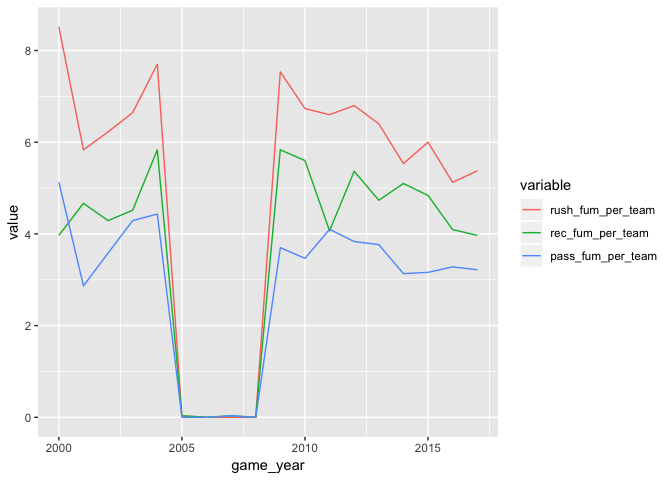
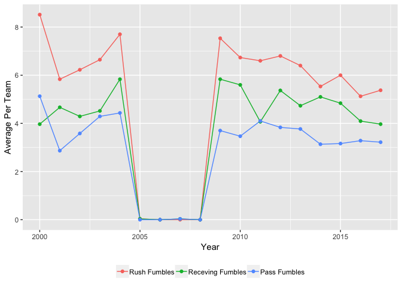
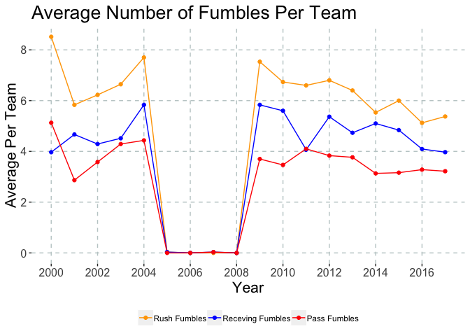

### \#TidyTuesday 8-28-18

This week’s data is NFL statistics. I only know a little bit about
football so the visualization I did may not be super informative, but
half the learning is in the process. I got the general idea from the
[article](https://www.eldo.co/nfl-rushing-and-passing-in-four-charts.html)
included with the data. Let’s get started\!

First, we want to load the R package we are going to use. Since it’s
\#TidyTuesday, we’ll be using the tidyverse. Next step is to read in our
data. The .csv file can be downloaded
[here](https://github.com/rfordatascience/tidytuesday/blob/master/data/2018-08-28/nfl_2010-2017.csv).

``` r
library(tidyverse)

data <- read_csv("nfl_2000-2017.csv")
```

    ## Warning: Missing column names filled in: 'X1' [1]

    ## Parsed with column specification:
    ## cols(
    ##   .default = col_integer(),
    ##   name = col_character(),
    ##   team = col_character(),
    ##   rush_avg = col_double(),
    ##   rec_avg = col_double(),
    ##   rate = col_double(),
    ##   position = col_character()
    ## )

    ## See spec(...) for full column specifications.

``` r
data
```

    ## # A tibble: 81,525 x 23
    ##       X1 name  team  game_year game_week rush_att rush_yds rush_avg
    ##    <int> <chr> <chr>     <int>     <int>    <int>    <int>    <dbl>
    ##  1     1 Duce… PHI        2000         1       26      201      7.7
    ##  2     2 Lama… MIA        2000         1       27      145      5.4
    ##  3     3 Tiki… NYG        2000         1       13      144     11.1
    ##  4     4 Step… WAS        2000         1       23      133      5.8
    ##  5     5 Edge… IND        2000         1       28      124      4.4
    ##  6     6 Prie… BAL        2000         1       27      119      4.4
    ##  7     7 Curt… NYJ        2000         1       30      110      3.7
    ##  8     8 Robe… MIN        2000         1       14      109      7.8
    ##  9     9 Tim … CAR        2000         1       15       88      5.9
    ## 10    10 Cade… CHI        2000         1       10       87      8.7
    ## # ... with 81,515 more rows, and 15 more variables: rush_tds <int>,
    ## #   rush_fumbles <int>, rec <int>, rec_yds <int>, rec_avg <dbl>,
    ## #   rec_tds <int>, rec_fumbles <int>, pass_att <int>, pass_yds <int>,
    ## #   pass_tds <int>, int <int>, sck <int>, pass_fumbles <int>, rate <dbl>,
    ## #   position <chr>

This gives us a general idea of what is included in this data set. I
decided to focus on fumbles. There are three types of fumbles: rush
fumbles, receiving fumbles, & pass fumbles. There are also multiple
players listed per team. We need to create a data frame that totals each
type of fumble for all the players on that team for each year.

First, we use select() to select our columns of interest & remove all
the other columns. There are quite a few NAs in this data. For this
analysis, I set all NAs to 0 using mutate\_if(). Next, we group the rows
by team & year using group\_by(). Then the summarise() function allows
us to total each type of fumble for all the players listed on that team
in that year.

``` r
sum_team_year <- data %>%
  select(name, team, game_year, game_week, rush_fumbles, rec_fumbles, pass_fumbles) %>%
  mutate_if(is.numeric, funs(ifelse(is.na(.), 0, .))) %>%
  group_by(team, game_year) %>%
  summarise(rush_fum = sum(rush_fumbles), rec_fum = sum(rec_fumbles), pass_fum = sum(pass_fumbles))

sum_team_year
```

    ## # A tibble: 548 x 5
    ## # Groups:   team [?]
    ##    team  game_year rush_fum rec_fum pass_fum
    ##    <chr>     <int>    <dbl>   <dbl>    <dbl>
    ##  1 ARI        2000       11       5        5
    ##  2 ARI        2001        6       8        3
    ##  3 ARI        2002       10       6        4
    ##  4 ARI        2003        5       6        3
    ##  5 ARI        2004        8       3        7
    ##  6 ARI        2005        0       0        0
    ##  7 ARI        2006        0       0        0
    ##  8 ARI        2007        0       1        1
    ##  9 ARI        2008        0       0        0
    ## 10 ARI        2009       12      10        6
    ## # ... with 538 more rows

In the resulting data frame, you can see each team has one row for each
year with the appropriate number of fumbles.

Next, we want to find the number of fumbles for all the teams each year.
We start with the previous data frame (sum\_team\_year). First, we use
the ungroup() to remove our previous grouping. Then we can drop the team
column because it is no longer needed. We regroup the data frame by year
using group\_by(). Then we use the summarise function to get the total
number of each type of fumble for all the teams each year.

``` r
sum_year <- sum_team_year %>%
  ungroup() %>%
  select(-team) %>%
  group_by(game_year) %>%
  summarise(rush_fum_total = sum(rush_fum), rec_fum_total = sum(rec_fum), pass_fum_total = sum(pass_fum))

sum_year
```

    ## # A tibble: 18 x 4
    ##    game_year rush_fum_total rec_fum_total pass_fum_total
    ##        <int>          <dbl>         <dbl>          <dbl>
    ##  1      2000            264           123            159
    ##  2      2001            175           140             86
    ##  3      2002            193           133            111
    ##  4      2003            206           140            133
    ##  5      2004            231           175            133
    ##  6      2005              1             1              0
    ##  7      2006              0             0              0
    ##  8      2007              0             1              1
    ##  9      2008              0             0              0
    ## 10      2009            226           175            111
    ## 11      2010            202           168            104
    ## 12      2011            198           122            123
    ## 13      2012            204           161            115
    ## 14      2013            192           142            113
    ## 15      2014            166           153             94
    ## 16      2015            186           150             98
    ## 17      2016            164           131            105
    ## 18      2017            172           127            103

This leaves us with a data frame with 18 years. This makes sense becuase
we have 18 years in our dataset. Little checks like this along the way
can help us make sure we’re on the right track\!

Next, I want to find how many fumbles there were per team for each year.
To do this, I first need to determine the number of teams per year. A
quick Google search tells me that there are not necessarily the same
number of teams every year. Instead, I’ll use our data to make a new
data frame with the number of teams per year.

We can use the original data() object to make this data frame. First, we
select the columns we are interested in. Since there are multiple
players per team & I only wanted each team counted once, I used
distinct() to remove all the duplicate rows. Then I used select() to
remove the team column. I grouped the remaining data by year using
group\_by(). I used count() to count the number of times each year
appeared in the data frame. Each year will appear once for each team
that existed that year.

I used rename() to change the name of the “number of teams” column to
make things easier down the road. When you use rename(), the correct
usage is (new\_col\_name = old\_col\_name).

``` r
num_teams <- data %>%
  select(team, game_year) %>%
  distinct() %>%
  select(-team) %>%
  group_by(game_year) %>%
  count(game_year) %>%
  rename(num_team = n)

num_teams
```

    ## # A tibble: 18 x 2
    ## # Groups:   game_year [18]
    ##    game_year num_team
    ##        <int>    <int>
    ##  1      2000       31
    ##  2      2001       30
    ##  3      2002       31
    ##  4      2003       31
    ##  5      2004       30
    ##  6      2005       30
    ##  7      2006       30
    ##  8      2007       30
    ##  9      2008       30
    ## 10      2009       30
    ## 11      2010       30
    ## 12      2011       30
    ## 13      2012       30
    ## 14      2013       30
    ## 15      2014       30
    ## 16      2015       31
    ## 17      2016       32
    ## 18      2017       32

Then we need to join this data frame with the number of teams per year
with the yearly fumble data. There are a lot of different types of
joins. I’m not going to go too deep into that today. For this particular
example, I used a full join. A full join uses all rows in both data
frames. I think this is a good way to catch random data you may not
realize is in your data frame.

The full\_join() function takes three arguments: the first data frame,
the second data frame, & the column to join them by. Then I used
mutate() to determine how many fumbles per team there were for each
year. I used select() to retain only the columns I’m interested it.

If you have lots of columns with the same naming pattern or word, there
are a couple of helper functions you can use in your select() statement.

  - starts\_with()
      - finds column names that start with a certain string
  - ends\_with()
      - finds column names that end with a certain string
  - contains()
      - finds column names that contain that string.

For this example, I used contains() to keep all the columns that have
“per\_team” in their name.

After using select to get the columns I need, I used melt from the
reshape2 package to convert the data frame from wide to long.

``` r
total_df <- full_join(sum_year, num_teams, by="game_year") %>%
  mutate(rush_fum_per_team = (rush_fum_total/num_team), rec_fum_per_team = (rec_fum_total/num_team), pass_fum_per_team = (pass_fum_total/num_team)) %>%
  select(game_year, contains("per_team")) %>%
  reshape2::melt(id.vars="game_year")

total_df
```

    ##    game_year          variable      value
    ## 1       2000 rush_fum_per_team 8.51612903
    ## 2       2001 rush_fum_per_team 5.83333333
    ## 3       2002 rush_fum_per_team 6.22580645
    ## 4       2003 rush_fum_per_team 6.64516129
    ## 5       2004 rush_fum_per_team 7.70000000
    ## 6       2005 rush_fum_per_team 0.03333333
    ## 7       2006 rush_fum_per_team 0.00000000
    ## 8       2007 rush_fum_per_team 0.00000000
    ## 9       2008 rush_fum_per_team 0.00000000
    ## 10      2009 rush_fum_per_team 7.53333333
    ## 11      2010 rush_fum_per_team 6.73333333
    ## 12      2011 rush_fum_per_team 6.60000000
    ## 13      2012 rush_fum_per_team 6.80000000
    ## 14      2013 rush_fum_per_team 6.40000000
    ## 15      2014 rush_fum_per_team 5.53333333
    ## 16      2015 rush_fum_per_team 6.00000000
    ## 17      2016 rush_fum_per_team 5.12500000
    ## 18      2017 rush_fum_per_team 5.37500000
    ## 19      2000  rec_fum_per_team 3.96774194
    ## 20      2001  rec_fum_per_team 4.66666667
    ## 21      2002  rec_fum_per_team 4.29032258
    ## 22      2003  rec_fum_per_team 4.51612903
    ## 23      2004  rec_fum_per_team 5.83333333
    ## 24      2005  rec_fum_per_team 0.03333333
    ## 25      2006  rec_fum_per_team 0.00000000
    ## 26      2007  rec_fum_per_team 0.03333333
    ## 27      2008  rec_fum_per_team 0.00000000
    ## 28      2009  rec_fum_per_team 5.83333333
    ## 29      2010  rec_fum_per_team 5.60000000
    ## 30      2011  rec_fum_per_team 4.06666667
    ## 31      2012  rec_fum_per_team 5.36666667
    ## 32      2013  rec_fum_per_team 4.73333333
    ## 33      2014  rec_fum_per_team 5.10000000
    ## 34      2015  rec_fum_per_team 4.83870968
    ## 35      2016  rec_fum_per_team 4.09375000
    ## 36      2017  rec_fum_per_team 3.96875000
    ## 37      2000 pass_fum_per_team 5.12903226
    ## 38      2001 pass_fum_per_team 2.86666667
    ## 39      2002 pass_fum_per_team 3.58064516
    ## 40      2003 pass_fum_per_team 4.29032258
    ## 41      2004 pass_fum_per_team 4.43333333
    ## 42      2005 pass_fum_per_team 0.00000000
    ## 43      2006 pass_fum_per_team 0.00000000
    ## 44      2007 pass_fum_per_team 0.03333333
    ## 45      2008 pass_fum_per_team 0.00000000
    ## 46      2009 pass_fum_per_team 3.70000000
    ## 47      2010 pass_fum_per_team 3.46666667
    ## 48      2011 pass_fum_per_team 4.10000000
    ## 49      2012 pass_fum_per_team 3.83333333
    ## 50      2013 pass_fum_per_team 3.76666667
    ## 51      2014 pass_fum_per_team 3.13333333
    ## 52      2015 pass_fum_per_team 3.16129032
    ## 53      2016 pass_fum_per_team 3.28125000
    ## 54      2017 pass_fum_per_team 3.21875000

Now we’re ready to plot our data\! For this, I decided to use a line
plot to vizualize the three different groups.

``` r
ggplot(total_df) +
  geom_line(aes(game_year, value, group=variable, color=variable))
```

<!-- -->

Let’s add some points to make the years stand out a bit more\!

``` r
ggplot(total_df) +
  geom_line(aes(game_year, value, group = variable, color = variable)) +
  geom_point(aes(game_year, value, group = variable, color = variable))
```

<!-- -->

Now let’s clean it up a bit\! First, I would like to change the labels
in the legend. To do this, I need to rename the factors. This is the
first line added into the code below. Next, I want to relabel the axes
so they make more sense. I also used theme() to move the legend to the
bottom of the plot & remove the
title.

``` r
levels(total_df$variable) <- c('Rush Fumbles', 'Receving Fumbles', 'Pass Fumbles')

ggplot(total_df) +
  geom_line(aes(game_year, value, group = variable, color = variable)) +
  geom_point(aes(game_year, value, group = variable, color = variable)) +
  xlab("Year") +
  ylab("Average Per Team") +
  theme(legend.position = "bottom", legend.title=element_blank())
```

<!-- -->

Next I want to change the color for each group. I can do this using
scale\_color\_manual(). Note: If you used fill to color whatever type of
graph you have, changing the color would use scale\_fill\_manual(). I
added to the theme() function to change the major grid lines to dotted
gray lines. Then I removed the minor grid, the panel border & the panel
background. I also bumped up the font size for the axis title, tick mark
labels, & the soon to be added title. I used scale\_x\_continuous() &
the scales package to add more tick marks. Last of all, I added a title
to the
plot.

``` r
levels(total_df$variable) <- c('Rush Fumbles', 'Receving Fumbles', 'Pass Fumbles')

ggplot(total_df) +
  geom_line(aes(game_year, value, group = variable, color = variable)) +
  geom_point(aes(game_year, value, group = variable, color = variable)) +
  xlab("Year") +
  ylab("Average Per Team") +
  theme(legend.position = "bottom",
    legend.title=element_blank(),
    panel.grid.major = element_line(colour = 'azure3', linetype = 'dashed'),
    panel.grid.minor = element_blank(),
    panel.border = element_blank(),
    panel.background = element_blank(),
    axis.text = element_text(size = 12),
    axis.title = element_text(size = 16) ,
    plot.title = element_text(size = 20)) +
  scale_x_continuous(breaks=scales::pretty_breaks(10)) +
  scale_color_manual(values=c("orange", "blue", "red")) +
  ggtitle("Average Number of Fumbles Per Team")
```

<!-- -->

Something is going on with the data for 2005 through 2008. There are a
lot of NAs in the fumbles data for these four years. I’m not sure why
this is. All the NAs were set to 0 so the averages end up being veyr
low. Any insight would be appreciated. You can reach out to me via
Twitter at @sapo83 if you have any ideas\! Also if you have any other
thoughts or insights about this tutorial.
