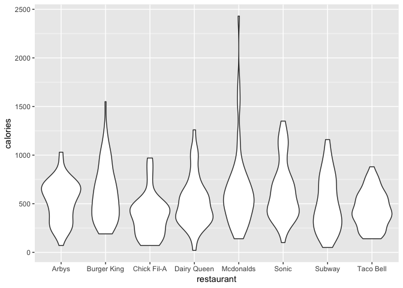
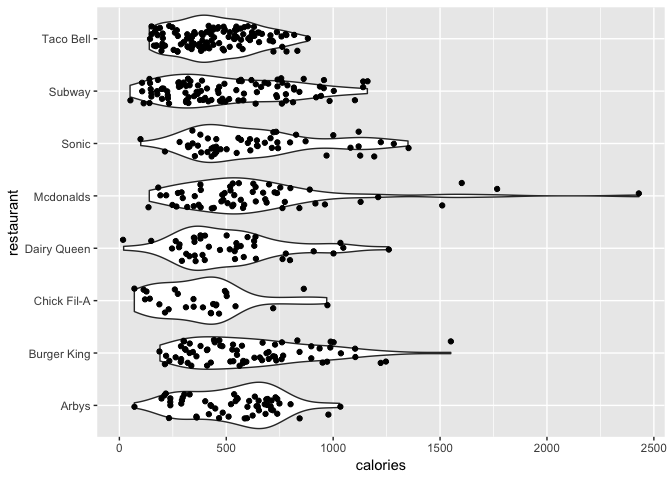

### \#TidyTuesday 9-4-18 Week 23

This week’s data is fast food nutritional data. The data can be found
[here](https://github.com/rfordatascience/tidytuesday/blob/master/data/2018-09-04/fastfood_calories.csv).

First, let’s load the tidyverse library & read in our data.

``` r
library(tidyverse)

data <- read_csv("fastfood_calories.csv")
```

    ## Warning: Missing column names filled in: 'X1' [1]

    ## Parsed with column specification:
    ## cols(
    ##   X1 = col_integer(),
    ##   restaurant = col_character(),
    ##   item = col_character(),
    ##   calories = col_integer(),
    ##   cal_fat = col_integer(),
    ##   total_fat = col_integer(),
    ##   sat_fat = col_double(),
    ##   trans_fat = col_double(),
    ##   cholesterol = col_integer(),
    ##   sodium = col_integer(),
    ##   total_carb = col_integer(),
    ##   fiber = col_integer(),
    ##   sugar = col_integer(),
    ##   protein = col_integer(),
    ##   vit_a = col_integer(),
    ##   vit_c = col_integer(),
    ##   calcium = col_integer(),
    ##   salad = col_character()
    ## )

Today, we’re going to do a violin plot. In this case, the violin plot
will show the distribution of calories for each item grouped by
restaurant.

First, let’s use select() to get the columns we need. For this plot, all
we need is the restaurant & the calories columns. We’ll use head() to
take a peek at the data & make sure everything looks ok\!

``` r
data1 <- data %>%
  select(restaurant, calories)

head(data1)
```

    ## # A tibble: 6 x 2
    ##   restaurant calories
    ##   <chr>         <int>
    ## 1 Mcdonalds       380
    ## 2 Mcdonalds       840
    ## 3 Mcdonalds      1130
    ## 4 Mcdonalds       750
    ## 5 Mcdonalds       920
    ## 6 Mcdonalds       540

Let’s do the basic plot. Looking at the basic plot lets us make sure
that we’re headed in the right direction.

``` r
ggplot(data1) +
  geom_violin(aes(restaurant, calories))
```

<!-- -->

Looks good so far\! Let’s add a little more information. We can add a
point for each individual item. This helps us get a better understanding
of our data. For that we add geom\_jitter() using the same aes() call as
before. More about geom\_jitter
[here](https://ggplot2.tidyverse.org/reference/geom_jitter.html).

``` r
ggplot(data1) +
  geom_violin(aes(restaurant, calories)) +
  geom_jitter(aes(restaurant, calories))
```

<!-- -->

This helps but we can make those points look better. We can make the
distribution tighter by adding a width argument to the geom\_jitter()
call. You might need to play with this a little bit to get the grouping
the way you would like.

``` r
ggplot(data1) +
  geom_violin(aes(restaurant, calories)) +
  geom_jitter(aes(restaurant, calories), width= 0.25)
```

<!-- -->

Next, I would like to see these violin plots horizontally instead of
vertically. For this we use coord\_flip().

``` r
ggplot(data1) +
  geom_violin(aes(restaurant, calories)) +
  geom_jitter(aes(restaurant, calories), width= 0.25) +
  coord_flip()
```

<!-- -->

I like that better\! Now let’s make it pretty. First, we’ll add some
color. We add color to the aes call in both geom\_violin() &
geom\_jitter(). Then we add scale\_color\_brewer() to pick our color
palette.

``` r
ggplot(data1) +
  geom_violin(aes(restaurant, calories, color = restaurant)) +
  geom_jitter(aes(restaurant, calories, color = restaurant), width= 0.25) +
  coord_flip() +
  scale_color_brewer(palette="Set1")
```

<!-- -->

Now let’s start cleaning it up. Let’s remove the legend. It’s not really
helping us here. Also, I want to remove the axis titles & bump up the
font size on the tick mark labels. All of this can be done in the
theme() call.

``` r
ggplot(data1) +
  geom_violin(aes(restaurant, calories, color = restaurant)) +
  geom_jitter(aes(restaurant, calories, color = restaurant), width= 0.25) +
  coord_flip() +
  theme(legend.position = "none",
    axis.title = element_blank(),
    axis.text = element_text(size = 14)) +
  scale_color_brewer(palette="Set1")
```

<!-- -->

Now that’s looking better. Next, I removed the backgound panel, grid
lines & border. I also want to remove the tick marks on the y-axis. I
made the x-axis grid lines gray & dashed. All these things can be
changed in the theme() call.

``` r
ggplot(data1) +
  geom_violin(aes(restaurant, calories, color = restaurant)) +
  geom_jitter(aes(restaurant, calories, color = restaurant), width= 0.25) +
  coord_flip() +
  theme(legend.position = "none",
    axis.title = element_blank(),
    axis.text = element_text(size = 14),
    axis.ticks.y = element_blank(),
    panel.grid.major.x = element_line(color = 'gray', linetype= 'dashed'),
    panel.background = element_blank()) +
  scale_color_brewer(palette="Set1")
```

<!-- -->

Last of all, let’s reorder the y-axis alphabetically & add in a title.

To reorder the title, all we need to do is reverse the order. We can use
fct\_rev() from the forcats package. The forcats package is included in
the tidyverse.

To add the title, we can use ggtitle(). I added a “plot.title =
element\_text(hjust = 0.5)” in the theme() call to center it.

Now let’s have a look at our final plot\!

``` r
ggplot(data1) +
  geom_violin(aes(fct_rev(restaurant), calories, color = restaurant)) +
  geom_jitter(aes(fct_rev(restaurant), calories, color = restaurant), width= 0.25) +
  coord_flip() +
  theme(legend.position = "none",
    axis.title = element_blank(),
    axis.text = element_text(size = 14),
    axis.ticks.y = element_blank(),
    panel.grid.major.x = element_line(color = 'gray', linetype= 'dashed'),
    panel.background = element_blank(),
    plot.title = element_text(hjust = 0.5)) +
  scale_color_brewer(palette="Set1") +
  ggtitle("Distribution of Calories per Item by Restaurant")
```

<!-- -->

Looks great\! If you have any questions or comments, feel free to reach
out to me on [Twitter](https://twitter.com/sapo83)\!
