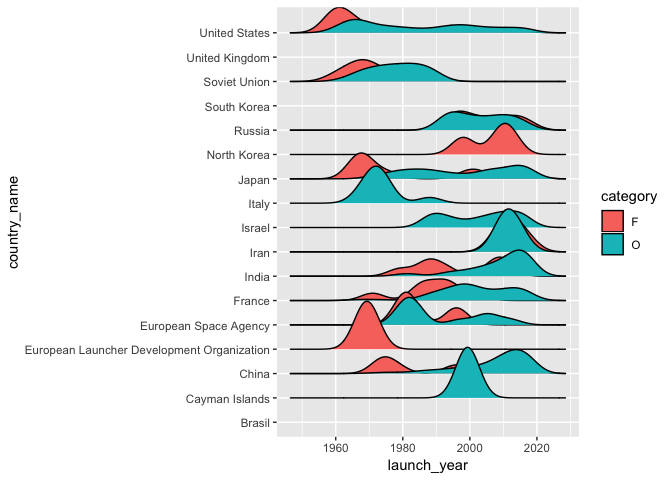
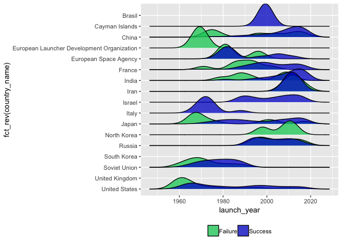
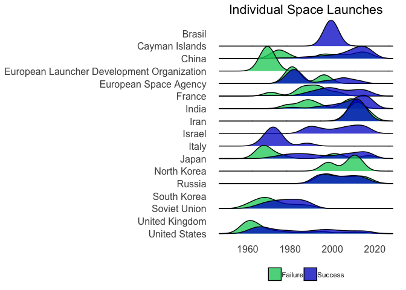

### \#TidyTuesday 1-15-19 Week 3

This week’s data covers space launches. The data can be found
[here](https://github.com/rfordatascience/tidytuesday/tree/master/data/2019/2019-01-15).

I’ve decided to do a ridgeline plot vizualizing launches over time by
each country. I’ll further categorize the data by success or failure of
the launch.

This week, I’m changing things up a bit. I added in a few lines of code
to show how you can download the data files from the command line using
`curl`.

``` bash
curl -o agencies.csv https://raw.githubusercontent.com/rfordatascience/tidytuesday/master/data/2019/2019-01-15/agencies.csv

curl -o launches.csv https://raw.githubusercontent.com/rfordatascience/tidytuesday/master/data/2019/2019-01-15/launches.csv
```

Let’s load our libraries and read in our data. To do a ridgeline plot,
I’m using the ggridges package. Then, I’ll use `head()` to take a look
at the data.

``` r
library(tidyverse)
library(ggridges)

data <- read_csv("launches.csv")
```

    ## Parsed with column specification:
    ## cols(
    ##   tag = col_character(),
    ##   JD = col_double(),
    ##   launch_date = col_date(format = ""),
    ##   launch_year = col_integer(),
    ##   type = col_character(),
    ##   variant = col_character(),
    ##   mission = col_character(),
    ##   agency = col_character(),
    ##   state_code = col_character(),
    ##   category = col_character(),
    ##   agency_type = col_character()
    ## )

``` r
head(data)
```

    ## # A tibble: 6 x 11
    ##   tag       JD launch_date launch_year type  variant mission agency
    ##   <chr>  <dbl> <date>            <int> <chr> <chr>   <chr>   <chr> 
    ## 1 1967… 2.44e6 1967-06-29         1967 Thor… <NA>    Secor … US    
    ## 2 1967… 2.44e6 1967-08-23         1967 Thor… <NA>    DAPP 3… US    
    ## 3 1967… 2.44e6 1967-10-11         1967 Thor… <NA>    DAPP 4… US    
    ## 4 1968… 2.44e6 1968-05-23         1968 Thor… <NA>    DAPP 5… US    
    ## 5 1968… 2.44e6 1968-10-23         1968 Thor… <NA>    DAPP 6… US    
    ## 6 1969… 2.44e6 1969-07-23         1969 Thor… <NA>    DAPP 7… US    
    ## # ... with 3 more variables: state_code <chr>, category <chr>,
    ## #   agency_type <chr>

For the final plot, I want to use actual country names instead of the
codes. I couldn’t find a file that has this data in it. I’ll make my own
data frame instead. I used a bit of inference to figure out the
countries so there might be errors.

This is an example of how to make a data frame from scratch. First, I
created two vectors: one with the abbreviations & one with the full
country name. Each vector will be a column in the new data frame. The
name of the vector will be the column name in the new data frame. Order
is important here\! The order of each vector needs to match up. Then I
used `data.frame()` to join them. You could do this with more than two
vectors/columns if need be.

Then I used `head()` again to make sure it looks as
expected.

``` r
state_code <- c("US", "UK", "SU", "RU", "KR", "KP", "J", "IR", "IN", "IL", "I-ESA", "I-ELDO", "I", "F", "CYM", "CN", "BR")
country_name <- c("United States", "United Kingdom", "Soviet Union", "Russia", "South Korea", "North Korea", "Japan", "Iran", "India", "Israel", "European Space Agency", "European Launcher Development Organization", "Italy", "France", "Cayman Islands", "China", "Brasil")

country_df <- data.frame(state_code, country_name)

head(country_df)
```

    ##   state_code   country_name
    ## 1         US  United States
    ## 2         UK United Kingdom
    ## 3         SU   Soviet Union
    ## 4         RU         Russia
    ## 5         KR    South Korea
    ## 6         KP    North Korea

Looks good\! I’ll join the country name data frame to the original data.
I used `left_join()` to join the two data frames by the “state\_code”
column.

``` r
data2 <- data %>%
  left_join(country_df, by = "state_code")
```

    ## Warning: Column `state_code` joining character vector and factor, coercing
    ## into character vector

``` r
head(data2)
```

    ## # A tibble: 6 x 12
    ##   tag       JD launch_date launch_year type  variant mission agency
    ##   <chr>  <dbl> <date>            <int> <chr> <chr>   <chr>   <chr> 
    ## 1 1967… 2.44e6 1967-06-29         1967 Thor… <NA>    Secor … US    
    ## 2 1967… 2.44e6 1967-08-23         1967 Thor… <NA>    DAPP 3… US    
    ## 3 1967… 2.44e6 1967-10-11         1967 Thor… <NA>    DAPP 4… US    
    ## 4 1968… 2.44e6 1968-05-23         1968 Thor… <NA>    DAPP 5… US    
    ## 5 1968… 2.44e6 1968-10-23         1968 Thor… <NA>    DAPP 6… US    
    ## 6 1969… 2.44e6 1969-07-23         1969 Thor… <NA>    DAPP 7… US    
    ## # ... with 4 more variables: state_code <chr>, category <chr>,
    ## #   agency_type <chr>, country_name <fct>

Let’s make our plot\! I used `geom_density_ridges()` to make the initial
ridegeline plot.

``` r
ggplot(data2) +
  geom_density_ridges(aes(x = launch_year, y = country_name, fill = category))
```

    ## Picking joint bandwidth of 3.51

<!-- -->

Not bad\! Let’s clean it up a bit. First, I’m going to reorder the
y-axis. I’d like to see everything in alphabetical order.

``` r
ggplot(data2) +
  geom_density_ridges(aes(x = launch_year, y = fct_rev(country_name), fill = category))
```

    ## Picking joint bandwidth of 3.51

<!-- -->

Next, I’d like to change the colors a bit. I’m thinking green for a
failed launch & blue for a successful launch. I’m also going to make
them slightly transparent to improve readability. To change the colors,
you can use `scale_fill_manual()`. To change the transparency, you can
add an alpha value to the `geom_density_ridges()` call.

``` r
ggplot(data2) +
  geom_density_ridges(aes(x = launch_year, y = fct_rev(country_name), fill = category), alpha = 0.75) +
  scale_fill_manual(values = c("springgreen3", "mediumblue"))
```

    ## Picking joint bandwidth of 3.51

<!-- -->

Now, I need to clean up the legend a bit. I want to change the wording
on the legend & move the legend to the bottom of the plot. The labels on
the legend can be changed by adding a “labels” command to the
`scale_fill_manual()` call. The label order needs to match the order of
the colors.

I added a `theme()` call to move the legend to the bottom & remove the
title from the legend.

``` r
ggplot(data2) +
  geom_density_ridges(aes(x = launch_year, y = fct_rev(country_name), fill = category), alpha = 0.75) +
  scale_fill_manual(labels = c("Failure", "Success"), values = c("springgreen3", "mediumblue")) +
  theme(legend.position = "bottom",
    legend.title = element_blank())
```

    ## Picking joint bandwidth of 3.51

<!-- -->

I’d like to remove the axis titles next. This can be done in the
`theme()` call using `axis.title = element_blank()`. I would also like
to change the font size on the axis tick marks. This can also be done in
the `theme()` call.

``` r
ggplot(data2) +
  geom_density_ridges(aes(x = launch_year, y = fct_rev(country_name), fill = category), alpha = 0.75) +
  scale_fill_manual(labels = c("Failure", "Success"), values = c("springgreen3", "mediumblue")) +
  theme(legend.position = "bottom",
    legend.title = element_blank(),
    axis.title = element_blank(),
    axis.text = element_text(size = 12))
```

    ## Picking joint bandwidth of 3.51

<!-- -->

Next, I’m going to remove the panel background & the tick marks on the
axis. These can both be done in the `theme()` call. Last of all, I’m
going to add a plot title using `ggtitle()`. I centered the title &
changed the font size in the `theme()` call.

``` r
ggplot(data2) +
  geom_density_ridges(aes(x = launch_year, y = fct_rev(country_name), fill = category), alpha = 0.75) +
  scale_fill_manual(labels = c("Failure", "Success"), values = c("springgreen3", "mediumblue")) +
  ggtitle("Individual Space Launches") +
  theme(legend.position = "bottom",
    legend.title = element_blank(),
    axis.title = element_blank(),
    axis.text = element_text(size = 12),
    panel.background = element_blank(),
    axis.ticks = element_blank(),
    plot.title = element_text(hjust = 0.5, size = 16))
```

    ## Picking joint bandwidth of 3.51

<!-- -->

Looks good\! If you have any feedback/questions, please feel free to
create an issue or pull request. You can always connect with me on
[Twitter](https://twitter.com/sapo83).
