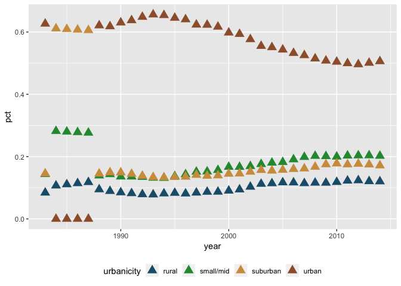

### \#TidyTuesday 1-22-19 Week 4

This week’s data is about incarceration trends across the United States.
The data is available in it’s original form or different subsets
[here](https://github.com/rfordatascience/tidytuesday/tree/master/data/2019/2019-01-22).

I’ve decided to take a look at the total jail population in Illinois
based on urbanicity (which I did not know was a word until today\!).

As I mentioned above, the original data file is available. There are
also smaller files that are subsets of the data. I’m going to start by
downloading the original data
file.

``` bash
curl -o incarceration_trends.csv https://raw.githubusercontent.com/rfordatascience/tidytuesday/master/data/2019/2019-01-22/incarceration_trends.csv
```

Next, I’m going to load the `tidyverse` library & read in my data. There
are a lot of NAs in this data. To make sure they are handled the way I
want them to, I added `na = c("", "NA")` to the `read_csv()` function.
This just tells R that if there is no data in that field to put an NA in
that field. I used `head()` to get a peek at the data & make sure
everything looks ok.

``` r
library(tidyverse)

data <- read_csv("incarceration_trends.csv", na = c("", "NA"))
```

    ## Parsed with column specification:
    ## cols(
    ##   .default = col_integer(),
    ##   state = col_character(),
    ##   county_name = col_character(),
    ##   urbanicity = col_character(),
    ##   region = col_character(),
    ##   division = col_character(),
    ##   land_area = col_double(),
    ##   total_jail_adm = col_double(),
    ##   total_jail_pop = col_double(),
    ##   female_jail_pop = col_double(),
    ##   male_jail_pop = col_double(),
    ##   asian_jail_pop = col_double(),
    ##   black_jail_pop = col_double(),
    ##   latino_jail_pop = col_double(),
    ##   white_jail_pop = col_double(),
    ##   total_jail_pretrial = col_double(),
    ##   female_jail_pretrial = col_double(),
    ##   male_jail_pretrial = col_double(),
    ##   jail_from_state_prison = col_double(),
    ##   jail_from_other_state_prison = col_double(),
    ##   jail_from_state_jail = col_double()
    ##   # ... with 3 more columns
    ## )

    ## See spec(...) for full column specifications.

``` r
head(data)
```

    ## # A tibble: 6 x 79
    ##    yfips  year  fips state county_name total_pop total_pop_15to64
    ##    <int> <int> <int> <chr> <chr>           <int>            <int>
    ## 1 1.97e8  1970  1001 AL    Autauga Co…     24661            14154
    ## 2 1.97e8  1971  1001 AL    Autauga Co…     25503            14765
    ## 3 1.97e8  1972  1001 AL    Autauga Co…     27156            15939
    ## 4 1.97e8  1973  1001 AL    Autauga Co…     28453            16906
    ## 5 1.97e8  1974  1001 AL    Autauga Co…     29261            17578
    ## 6 1.98e8  1975  1001 AL    Autauga Co…     29716            18007
    ## # ... with 72 more variables: female_pop_15to64 <int>,
    ## #   male_pop_15to64 <int>, asian_pop_15to64 <int>, black_pop_15to64 <int>,
    ## #   latino_pop_15to64 <int>, native_pop_15to64 <int>,
    ## #   other_pop_15to64 <int>, white_pop_15to64 <int>, urbanicity <chr>,
    ## #   region <chr>, division <chr>, commuting_zone <int>, metro_area <int>,
    ## #   land_area <dbl>, total_jail_adm <dbl>, total_jail_adm_dcrp <int>,
    ## #   female_jail_adm_dcrp <int>, male_jail_adm_dcrp <int>,
    ## #   total_jail_pop <dbl>, female_jail_pop <dbl>, male_jail_pop <dbl>,
    ## #   asian_jail_pop <dbl>, black_jail_pop <dbl>, latino_jail_pop <dbl>,
    ## #   native_jail_pop <int>, white_jail_pop <dbl>,
    ## #   total_jail_pretrial <dbl>, female_jail_pretrial <dbl>,
    ## #   male_jail_pretrial <dbl>, jail_from_state_prison <dbl>,
    ## #   jail_from_other_state_prison <dbl>, jail_from_state_jail <dbl>,
    ## #   jail_from_other_state_jail <dbl>, jail_from_fed <dbl>,
    ## #   jail_from_ice <dbl>, total_jail_pop_dcrp <int>,
    ## #   female_jail_pop_dcrp <int>, male_jail_pop_dcrp <int>,
    ## #   total_prison_pop <int>, female_prison_pop <int>,
    ## #   male_prison_pop <int>, asian_prison_pop <int>, black_prison_pop <int>,
    ## #   latino_prison_pop <int>, native_prison_pop <int>,
    ## #   other_prison_pop <int>, white_prison_pop <int>,
    ## #   total_prison_adm <int>, female_prison_adm <int>,
    ## #   male_prison_adm <int>, asian_prison_adm <int>, black_prison_adm <int>,
    ## #   latino_prison_adm <int>, native_prison_adm <int>,
    ## #   other_prison_adm <int>, white_prison_adm <int>, num_facilites <int>,
    ## #   num_employees <int>, confined_pop <int>, capacity <int>,
    ## #   ucr_population <int>, index_crime <int>, violent_crime <int>,
    ## #   property_crime <int>, murder_crime <int>, rape_crime <int>,
    ## #   robbery_crime <int>, agr_assault_crime <int>, burglary_crime <int>,
    ## #   larceny_crime <int>, mv_theft_crime <int>, arson_crime <int>

That’s a lot of columns\!\!\! If you want a break down of what each
column means, there is a writeup available
[here](chrome-extension://oemmndcbldboiebfnladdacbdfmadadm/https://raw.githubusercontent.com/vera-institute/incarceration_trends/master/incarceration_trends-Codebook.pdf).

I’m going to start by filtering the data by state (Illinois) & year. I
filtered by year because all the values before 1983 & after 2014 are NA.
This lends nothing to the final analysis, so I dropped them.

There are four types of urbanicity:

  - rural
  - small/mid
  - suburban
  - urban

Next I grouped the data frame by urbanicity & year. Last of all, I used
`summarise()` to get the total prison population for each urbanicity in
each year. I add `na.rm=TRUE` to the `sum()` function in `summarise()`.
This will ignore all the NAs. This is my way of not having to really
deal with the missing data.

Another option to deal with NAs is imputation. Imputation is inferring
missing values based on the data you already have. There are numerous
ways to do that. It’s not something I have a lot of experience with so I
decided to simply omit the NAs from my calculations. If you would like
to learn more about imputation, a quick Google search should give you
some good options\!

``` r
subset_pop_df <- data %>%
  filter(state == "IL", year >= 1983, year < 2015) %>%
  group_by(urbanicity, year) %>%
  summarise(subsetJailPop = sum(total_prison_pop, na.rm=TRUE))
```

I’d like to show these values as a percent of the total, rather than raw
counts. I think this makes it easier to compare the data across years.
I’ll start by creating a new data frame to find the total prision
population for each year. I filtered the data by state & year to keep
only the rows we are interested in. I grouped the data by year & then
used `summarise()` to find the total jail population for each year.

``` r
total_pop_df <- data %>%
  filter(state == "IL", year >= 1983, year < 2015) %>%
  group_by(year) %>%
  summarise(totalJailPop = sum(total_prison_pop, na.rm=TRUE))
```

To calculate the percent for each urbanicity in each year, I’m going to
bind the two data frames together. I used `left_join()` do add the total
jail population to each row for the appropriate year. I used `mutate()`
to calculate the percent for each urbanicity in each year. I used select
to keep only the columns I’ll need for the plot.

``` r
fin_df <- left_join(subset_pop_df, total_pop_df, by = "year") %>%
  mutate(pct = subsetJailPop/totalJailPop) %>%
  select(urbanicity, year, pct)

fin_df
```

    ## # A tibble: 128 x 3
    ## # Groups:   urbanicity [4]
    ##    urbanicity  year    pct
    ##    <chr>      <int>  <dbl>
    ##  1 rural       1983 0.0842
    ##  2 rural       1984 0.107 
    ##  3 rural       1985 0.111 
    ##  4 rural       1986 0.114 
    ##  5 rural       1987 0.118 
    ##  6 rural       1988 0.0947
    ##  7 rural       1989 0.0893
    ##  8 rural       1990 0.0850
    ##  9 rural       1991 0.0823
    ## 10 rural       1992 0.0789
    ## # ... with 118 more rows

Everything looks good\! Let’s start with a basic dot plot to visualize
our data. I would like the percent on the y axis, the year on the x-axis
& the color of the dot to represent urbanicity.

``` r
ggplot(fin_df) +
  geom_point(aes(x = year, y = pct, color = urbanicity))
```

<!-- -->

Everything looks good\! Now let’s make it pretty. First thing I’m going
to do is move the legend to the bottom of the plot. I do this for
multiple reasons. Mainly, it widens the plot area giving us a bit more
room to work with. When you have a lot of categories in a legend, I
think it’s easier to read in one line instead of a column. I also think
the legend looks better centered on the bottom. I used the `theme()`
call to move the legend.

``` r
ggplot(fin_df) +
  geom_point(aes(x = year, y = pct, color = urbanicity)) +
  theme(legend.position = "bottom")
```

<!-- -->

I like that better\! The next thing I would like to do is make the
points a bit larger. I also changed the shape of the point simply
because I could\! Both of these are done in the `geom_point()` call but
outside of the `aes()` call. I’m also going to add a color palette
because the shape I choose will look different based on the colors I
choose. I used `scale_color_manual()` to change the color palette.

``` r
ggplot(fin_df) +
  geom_point(aes(x = year, y = pct, color = urbanicity), size = 4, shape = 17) +
  theme(legend.position = "bottom") +
  scale_color_manual(values = c("#205e79", "#25963E", "#D19C4C", "#9D5F38"))
```

<!-- -->

That looks better. Next I would like to fix the axes. First off, I want
the y-axis to be labeled as percents. This can be done by adding a
single line to the code: `scale_y_continuous(labels =
scales::percent_format(accuracy = 1))`. This changes the labels to
percents with 0 decimal places. `percent_format()` can be found in the
`scales` package.

Next, I’d like to see a few more labels on the x-axis, one every five
years. To do that, I added the `scale_x_continuous()` call. I set the
breaks in sequential order, starting with 1985, ending in 2014, and
inserting a tick mark every five years.

Last thing for the axes is to remove the titles, bump up the font size &
remove the tick marks. I can do all these things in the `theme()` call.

``` r
ggplot(fin_df) +
  geom_point(aes(x = year, y = pct, color = urbanicity), size = 4, shape = 17) +
  scale_y_continuous(labels = scales::percent_format(accuracy = 1)) +
  scale_x_continuous(breaks = seq(1985, 2014, 5)) +
  theme(legend.position = "bottom",
    axis.title = element_blank(),
    axis.ticks = element_blank(),
    axis.text = element_text(size = 12)) +
  scale_color_manual(values = c("#205e79", "#25963E", "#D19C4C", "#9D5F38"))
```

<!-- -->

Next, I’d like to remove the background panel & add in some grid lines.
I can start by adding `panel.background = element_blank()` to the
`theme()` call to remove the background panel.

For the gridlines, I would like the x-axis grid lines to be darker than
the y-axis grid lines. I also only want to plot major grid lines. I can
add two more lines to the `theme()` call to make this work. Fof the
x-axis, I added `panel.grid.major.x = element_line(linetype =
"longdash", color = "azure4")`. For the y-axis, I added
`panel.grid.major.y = element_line(linetype = "dashed", color =
"azure3")`.

``` r
ggplot(fin_df) +
  geom_point(aes(x = year, y = pct, color = urbanicity), size = 4, shape = 17) +
  scale_y_continuous(labels = scales::percent_format(accuracy = 1)) +
  scale_x_continuous(breaks = seq(1985, 2014, 5)) +
  theme(legend.position = "bottom",
    axis.title = element_blank(),
    axis.ticks = element_blank(),
    axis.text = element_text(size = 12),
    panel.background = element_blank(),
    panel.grid.major.x = element_line(linetype = "longdash", color = "azure4"),
    panel.grid.major.y = element_line(linetype = "dashed", color = "azure3")) +
  scale_color_manual(values = c("#205e79", "#25963E", "#D19C4C", "#9D5F38"))
```

<!-- -->

Now a few more minor clean up things. I’d like to add a title. I used
`ggtitle()` for this. I also added `plot.title = element_text(hjust
= 0.5, size = 16)` to the `theme()` call to change the location & size
of the title.

I’d like to change the font size of the legend & the legend title. I
added two lines to the `theme()` call to do this: `legend.text =
element_text(size=10)` & `legend.title = element_text(size = 12)`.
Lastly, I used `name=` in `scale_color_manual()` to capitalize the name
of the legend. This could also be changed by capitalizing the name of
the column in the original data frame.

``` r
ggplot(fin_df) +
  geom_point(aes(x = year, y = pct, color = urbanicity), size = 4, shape = 17) +
  scale_y_continuous(labels = scales::percent_format(accuracy = 1)) +
  scale_x_continuous(breaks = seq(1985, 2014, 5)) +
  theme(legend.position = "bottom",
    axis.title = element_blank(),
    axis.ticks = element_blank(),
    axis.text = element_text(size = 12),
    panel.background = element_blank(),
    panel.grid.major.x = element_line(linetype = "longdash", color = "azure4"),
    panel.grid.major.y = element_line(linetype = "dashed", color = "azure3"),
    plot.title = element_text(hjust = 0.5, size = 16),
    legend.text = element_text(size=10),
    legend.title = element_text(size = 12)) +
  scale_color_manual(name = "Urbanicity", values = c("#205e79", "#25963E", "#D19C4C", "#9D5F38")) +
  ggtitle("Population in Jail by Urbanicity in Illinois")
```

<!-- -->

This looks so good\! If you have any feedback/questions, please feel
free to create an issue or pull request. You can always connect with me
on [Twitter](https://twitter.com/sapo83).
