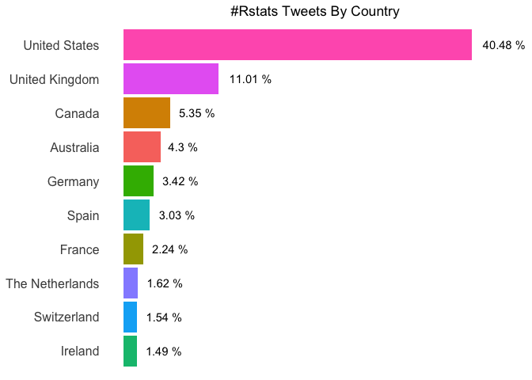

### \#TidyTuesday 1-1-19 Week 1

It’s the beginning of a new year & I’m already behind\! What’s new?

This week’s data is a peek into the statistics of last year’s
\#TidyTuesday & \#Rstats tweets. I’m going to start off with an analysis
of the number of Twitter users who tweeted aboout \#Rstats broken down
by country. All the data used in this analysis can be found
[here](https://github.com/rfordatascience/tidytuesday/tree/master/data/2019/2019-01-01).

Let’s start by loading the tidyverse library & our data. This data is
provided in .rds format. A quick google search shows that `readRDS()`
from base R can be used to read in this type of data. Then I’ll use
`head()` to take a quick look at the
    data.

``` r
library(tidyverse)
```

    ## ── Attaching packages ────────────────────────────────── tidyverse 1.2.1 ──

    ## ✔ ggplot2 3.1.0     ✔ purrr   0.2.5
    ## ✔ tibble  1.4.2     ✔ dplyr   0.7.7
    ## ✔ tidyr   0.8.2     ✔ stringr 1.3.1
    ## ✔ readr   1.1.1     ✔ forcats 0.3.0

    ## ── Conflicts ───────────────────────────────────── tidyverse_conflicts() ──
    ## ✖ dplyr::filter() masks stats::filter()
    ## ✖ dplyr::lag()    masks stats::lag()

``` r
data <- readRDS("rstats_tweets.rds")

head(data)
```

    ## # A tibble: 6 x 88
    ##   user_id status_id created_at          screen_name text  source
    ##   <chr>   <chr>     <dttm>              <chr>       <chr> <chr> 
    ## 1 5685812 10754715… 2018-12-19 19:22:47 hrbrmstr    JSON… Buffer
    ## 2 5685812 99492470… 2018-05-11 12:58:28 hrbrmstr    #rst… Twitt…
    ## 3 5685812 99908311… 2018-05-23 00:22:31 hrbrmstr    Whoa… Twitt…
    ## 4 5685812 10644994… 2018-11-19 12:43:29 hrbrmstr    Supe… Buffer
    ## 5 5685812 10037671… 2018-06-04 22:35:21 hrbrmstr    macO… Twitt…
    ## 6 5685812 10018088… 2018-05-30 12:53:31 hrbrmstr    Work… Twitt…
    ## # ... with 82 more variables: display_text_width <dbl>,
    ## #   reply_to_status_id <chr>, reply_to_user_id <chr>,
    ## #   reply_to_screen_name <chr>, is_quote <lgl>, is_retweet <lgl>,
    ## #   favorite_count <int>, retweet_count <int>, hashtags <list>,
    ## #   symbols <list>, urls_url <list>, urls_t.co <list>,
    ## #   urls_expanded_url <list>, media_url <list>, media_t.co <list>,
    ## #   media_expanded_url <list>, media_type <list>, ext_media_url <list>,
    ## #   ext_media_t.co <list>, ext_media_expanded_url <list>,
    ## #   ext_media_type <chr>, mentions_user_id <list>,
    ## #   mentions_screen_name <list>, lang <chr>, quoted_status_id <chr>,
    ## #   quoted_text <chr>, quoted_created_at <dttm>, quoted_source <chr>,
    ## #   quoted_favorite_count <int>, quoted_retweet_count <int>,
    ## #   quoted_user_id <chr>, quoted_screen_name <chr>, quoted_name <chr>,
    ## #   quoted_followers_count <int>, quoted_friends_count <int>,
    ## #   quoted_statuses_count <int>, quoted_location <chr>,
    ## #   quoted_description <chr>, quoted_verified <lgl>,
    ## #   retweet_status_id <chr>, retweet_text <chr>,
    ## #   retweet_created_at <dttm>, retweet_source <chr>,
    ## #   retweet_favorite_count <int>, retweet_retweet_count <int>,
    ## #   retweet_user_id <chr>, retweet_screen_name <chr>, retweet_name <chr>,
    ## #   retweet_followers_count <int>, retweet_friends_count <int>,
    ## #   retweet_statuses_count <int>, retweet_location <chr>,
    ## #   retweet_description <chr>, retweet_verified <lgl>, place_url <chr>,
    ## #   place_name <chr>, place_full_name <chr>, place_type <chr>,
    ## #   country <chr>, country_code <chr>, geo_coords <list>,
    ## #   coords_coords <list>, bbox_coords <list>, status_url <chr>,
    ## #   name <chr>, location <chr>, description <chr>, url <chr>,
    ## #   protected <lgl>, followers_count <int>, friends_count <int>,
    ## #   listed_count <int>, statuses_count <int>, favourites_count <int>,
    ## #   account_created_at <dttm>, verified <lgl>, profile_url <chr>,
    ## #   profile_expanded_url <chr>, account_lang <chr>,
    ## #   profile_banner_url <chr>, profile_background_url <chr>,
    ## #   profile_image_url <chr>

That’s a lot of columns\!\!\! I’m going to start by selecting the
columns I need using `select()`. Since the same person may have tweeted
multiple times, I need to save only one line where their user name &
country is recorded. I can use `distinct()` to keep only the unique
lines. I’m going to remove all users with an `NA` for the country.

``` r
user_df <- data %>%
  select(screen_name, country) %>%
  distinct() %>%
  drop_na()

user_df
```

    ## # A tibble: 2,280 x 2
    ##    screen_name   country       
    ##    <chr>         <chr>         
    ##  1 tangming2005  United States 
    ##  2 Ammer_B       United Kingdom
    ##  3 Ammer_B       Benin         
    ##  4 Ammer_B       Belgium       
    ##  5 Ammer_B       Malta         
    ##  6 Ammer_B       Sudan         
    ##  7 Ammer_B       Greece        
    ##  8 Ver0nesiFabi0 United Kingdom
    ##  9 monkmanmh     Canada        
    ## 10 marskar       United States 
    ## # ... with 2,270 more rows

A quick look at this data frame shows that some users have multiple
countries reported. To take this into account, we’re going to use the
number of rows in this data frame to calculate our percentages. To find
the number of rows in the data frame, I can use `nrow()`. I’m going to
save the number of rows to a variable (rowNum).

``` r
rowNum <- nrow(user_df)

rowNum
```

    ## [1] 2280

Now let’s get the counts for each country. First, we group the data
frame by country using `group_by()`. Then we use `summarise()` to get
the counts. Then, we’ll order the data frame by descending count.

``` r
count_df <- user_df %>%
  group_by(country) %>%
  summarise(count = n()) %>%
  arrange(-count)

count_df
```

    ## # A tibble: 106 x 2
    ##    country         count
    ##    <chr>           <int>
    ##  1 United States     923
    ##  2 United Kingdom    251
    ##  3 Canada            122
    ##  4 Australia          98
    ##  5 Germany            78
    ##  6 Spain              69
    ##  7 France             51
    ##  8 The Netherlands    37
    ##  9 Switzerland        35
    ## 10 Ireland            34
    ## # ... with 96 more rows

Next I’ll create the percent data frame. First, we’ll keep the top 10
counts. For this, I’ll use `top_n()`. If you wanted to get the bottom 10
values, you could use `top_n(-10)`. I’ll use mutate to calculate the
percentage using the row number variable we created earlier.

``` r
pct_df <- count_df %>%
  top_n(10) %>%
  mutate(pct = (count/rowNum) * 100)
```

    ## Selecting by count

``` r
pct_df
```

    ## # A tibble: 10 x 3
    ##    country         count   pct
    ##    <chr>           <int> <dbl>
    ##  1 United States     923 40.5 
    ##  2 United Kingdom    251 11.0 
    ##  3 Canada            122  5.35
    ##  4 Australia          98  4.30
    ##  5 Germany            78  3.42
    ##  6 Spain              69  3.03
    ##  7 France             51  2.24
    ##  8 The Netherlands    37  1.62
    ##  9 Switzerland        35  1.54
    ## 10 Ireland            34  1.49

Next, I’m going to plot the data. I’m going to use a bar chart.

``` r
ggplot(pct_df) +
  geom_col(aes(x = country, y = pct))
```

<!-- -->

Not bad\! Now let’s make it pretty. I’m going to add some color to the
bars by adding `fill =` to the `aes()` call. I’m going to use
`coord_flip()` to flip the plot on it’s side. This will make the
countries easier to read.

``` r
ggplot(pct_df) +
  geom_col(aes(x = country, y = pct, fill = country)) +
  coord_flip()
```

<!-- -->

I want to reorder the (old) x-axis by percent, highest to lowest. I can
do this by using `reorder()` in the `aes()` call. I’m also going to
remove the legend using the `theme()` call.

``` r
ggplot(pct_df) +
  geom_col(aes(x = reorder(country, pct), y = pct, fill = country)) +
  coord_flip() +
  theme(legend.position = "none")
```

<!-- -->

Then I want to add precent labels to the bars so the reader can identify
the acutal values. I can do this by adding a `geom_text()` call. I’m
going to use `round()` to format them to two decimal places. I’ll use
paste to add a “%” symbol as well. Lastly, I’ll use `hjust` to change
the justification of the labels. I would like them at the end of the
bar.

``` r
ggplot(pct_df) +
  geom_col(aes(x = reorder(country, pct), y = pct, fill = country)) +
  geom_text(aes(x = reorder(country, pct), y = pct, label = paste(round(pct, 2), "%")), hjust = -0.25) +
  coord_flip() +
  theme(legend.position = "none")
```

<!-- -->

Oops\! Now the label can’t be fully shown in the plot area. This can be
fixed by changing the limits on the plot area. This can be done by
simple trial & error. As I make more & more plots, I’ve tried to find a
more progrommatic way of doing this. We’re going to use a variable to
determine what the plot area should be.

I’m going to create a variable named “max” that holds the maximum
precentage in the data frame. Then `ylim()` can be used to change the
y-axis limits. I like this way because if the data in the data frame
changes then the y-axis limit changes along with it.

``` r
max <- max(pct_df$pct)

ggplot(pct_df) +
  geom_col(aes(x = reorder(country, pct), y = pct, fill = country)) +
  geom_text(aes(x = reorder(country, pct), y = pct, label = paste(round(pct, 2), "%")), hjust = -0.25) +
  coord_flip() +
  ylim(0, max * 1.10) +
  theme(legend.position = "none")
```

<!-- -->

Let’s do a final clean up\! I’m going to add a title using `ggtitle()`.
Using the `theme()` call, I’m going to remove the background panel,
remove the title & tick marks from both axes, change the font size on
the y-axis, remove the text from the x-axis, & center the title on the
plot.

``` r
max <- max(pct_df$pct)

ggplot(pct_df) +
  geom_col(aes(x = reorder(country, pct), y = pct, fill = country)) +
  geom_text(aes(x = reorder(country, pct), y = pct, label = paste(round(pct, 2), "%")), hjust = -0.25) +
  coord_flip() +
  ylim(0, max * 1.10) +
  ggtitle("#Rstats Tweets By Country") +
  theme(legend.position = "none",
    panel.background = element_blank(),
    axis.title = element_blank(),
    axis.ticks = element_blank(),
    axis.text.y = element_text(size = 12),
    axis.text.x = element_blank(),
    plot.title = element_text(hjust = 0.5))
```

<!-- -->

That looks great\! If you have any feedback/questions, please feel free
to create an issue or pull requet. You can always connect with me on
[Twitter](https://twitter.com/sapo83).
