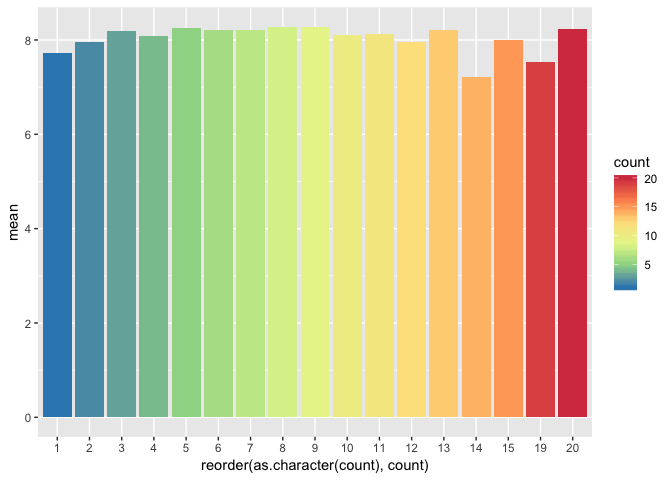
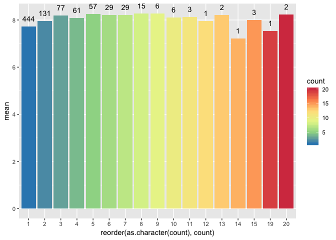
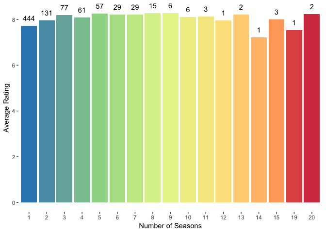
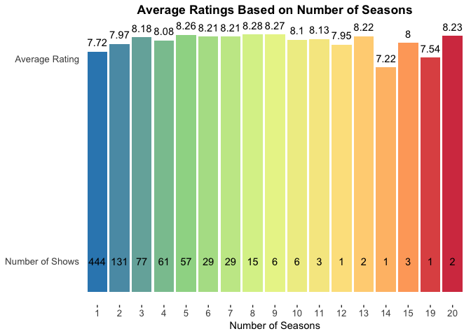

### \#TidyTuesday 1-08-19 Week 2

This week’s data is all about tv show ratings. The data can be found
[here](https://github.com/rfordatascience/tidytuesday/blob/master/data/2019/2019-01-08/IMDb_Economist_tv_ratings.csv).

Today, I’m going to look at the average rating of shows based on the
number of seasons they were on tv.

Let’s start by loading the tidyverse library & our data. I’ll use
`head()` to take a quick peek at the data.

``` r
library(tidyverse)

data <- read_csv("IMDb_Economist_tv_ratings.csv")
```

    ## Parsed with column specification:
    ## cols(
    ##   titleId = col_character(),
    ##   seasonNumber = col_integer(),
    ##   title = col_character(),
    ##   date = col_date(format = ""),
    ##   av_rating = col_double(),
    ##   share = col_double(),
    ##   genres = col_character()
    ## )

``` r
head(data)
```

    ## # A tibble: 6 x 7
    ##   titleId  seasonNumber title     date       av_rating share genres       
    ##   <chr>           <int> <chr>     <date>         <dbl> <dbl> <chr>        
    ## 1 tt28795…            1 11.22.63  2016-03-10      8.49  0.51 Drama,Myster…
    ## 2 tt31482…            1 12 Monke… 2015-02-27      8.34  0.46 Adventure,Dr…
    ## 3 tt31482…            2 12 Monke… 2016-05-30      8.82  0.25 Adventure,Dr…
    ## 4 tt31482…            3 12 Monke… 2017-05-19      9.04  0.19 Adventure,Dr…
    ## 5 tt31482…            4 12 Monke… 2018-06-26      9.14  0.38 Adventure,Dr…
    ## 6 tt18374…            1 13 Reaso… 2017-03-31      8.44  2.38 Drama,Mystery

Everything looks good here\! First, I need to find the number of seasons
for each show & the average ratings of all the seasons of that
particular show. I’ll use `select()` to keep only the columns I want:
title & average rating. Then `group_by()` will group all the shows by
title. I use `summarise()` to find the number of seasons for each show &
it’s average rating.

``` r
season_avgRating_df <- data %>%
  select(title, av_rating) %>%
  group_by(title) %>%
  summarise(avg = mean(av_rating), count = n())

head(season_avgRating_df)
```

    ## # A tibble: 6 x 3
    ##   title                  avg count
    ##   <chr>                <dbl> <int>
    ## 1 11.22.63              8.49     1
    ## 2 12 Monkeys            8.83     4
    ## 3 13 Reasons Why        7.97     2
    ## 4 24                    8.58     8
    ## 5 24: Legacy            7.20     1
    ## 6 24: Live Another Day  8.90     1

Next, I want to find the average rating for all tv shows with the same
number of seasons. I’ll use the data frame I made in the previous step.
I’ll use `group_by()` to group the shows by the number of seasons. I’ll
use `summarise()` to find the average rating for each group and the
number of shows that have that many seasons.

``` r
count_avgRating_df <- season_avgRating_df %>%
  group_by(count) %>%
  summarise(mean = mean(avg), numShows = n())

head(count_avgRating_df)
```

    ## # A tibble: 6 x 3
    ##   count  mean numShows
    ##   <int> <dbl>    <int>
    ## 1     1  7.72      444
    ## 2     2  7.97      131
    ## 3     3  8.18       77
    ## 4     4  8.08       61
    ## 5     5  8.26       57
    ## 6     6  8.21       29

``` r
#count_avgRating_df$count <- as.character(count_avgRating_df$count)
```

Looks good\! Let’s start with a basic bar chart.

``` r
ggplot(count_avgRating_df) +
  geom_col(aes(x = count, y = mean))
```

<!-- -->

That is close to what I expected but there are a few things I would like
to change. I want to remove those empty spaces. Those empty spaces are
in there because the count column has the type “int”. ggplot2 treats
this as a continuous scale.

To get this how I want, I can use `as.character()` to coerce ggplot2 to
treat it as a discrete scale. This will change the order so I wrap that
command with `reorder()` to get the categories to stay in numerical
order.

Sidenote - continuous vs discrete - A continuous scale can be any value
between two specified values. ggplot2 treats numbers as a continuous
scale. For this analysis, our numbers are actually disrete. There aren’t
1.8 seasons of a show (continuous). There is either 1 season or 2
seasons (discrete).

``` r
ggplot(count_avgRating_df) +
  geom_col(aes(x = reorder(as.character(count), count), y = mean))
```

<!-- -->

Now, we can see that the x-axis skips from shows with 15 seasons to
shows with 19 seasons. Let’s make it pretty\! I’m going to start by
adding some color. I’ll add `fill = count` to the `aes()` call. Then
I’ll use `scale_fill_distiller()` to set my palette. Since count is a
continuous scale, I can use a continuous color scale. If you wanted to
use a discrete color scale, you could use `fill = as.character(count)`.

``` r
ggplot(count_avgRating_df) +
  geom_col(aes(x = reorder(as.character(count), count), y = mean, fill = count)) +
  scale_fill_distiller(palette = "Spectral")
```

<!-- -->

Looks better\! Next I want to add the number of shows in each category
to the top of the bars. This is where the numShows column of the data
frame comes into play. I’ll use a `geom_text()` call & add label to the
`aes()` call. I’ll use vjust so they sit on top of the bar.

``` r
ggplot(count_avgRating_df) +
  geom_col(aes(x = reorder(as.character(count), count), y = mean, fill = count)) +
  geom_text(aes(x = reorder(as.character(count), count), y = mean, label = numShows), vjust = -1) +
  scale_fill_distiller(palette = "Spectral")
```

<!-- -->

Now let’s clean it up a bit\! I’m going to use `ylab()` & `xlab()` to
set the titles on the axes. I’ll use the `theme()` call to remove the
legend and the backgound panel.

``` r
ggplot(count_avgRating_df) +
  geom_col(aes(x = reorder(as.character(count), count), y = mean, fill = count)) +
  geom_text(aes(x = reorder(as.character(count), count), y = mean, label = numShows), vjust = -1) +
  scale_fill_distiller(palette = "Spectral") +
  ylab("Average Rating") +
  xlab("Number of Seasons") +
  theme(legend.position = "none",
    panel.background = element_blank())
```

<!-- -->

I’m not really liking this. I think the ratings are hard to
differentiate. I’m going to get a little crazy here\! I’m going to move
the number of shows label to the bottom of the bar. I’m going to use the
average rating as the label at the top of the bar. To do this, I
adjusted the y value on the numer of shows `geom_text()` call & added a
new `geom_text()` call for the average rating label.

``` r
ggplot(count_avgRating_df) +
  geom_col(aes(x = reorder(as.character(count), count), y = mean, fill = count)) +
  geom_text(aes(x = reorder(as.character(count), count), y = 1, label = numShows)) +
  geom_text(aes(x = reorder(as.character(count), count), y = mean, label = round(mean, 2)), vjust = -0.75) +
  scale_fill_distiller(palette = "Spectral") +
  ylab("Average Rating") +
  xlab("Number of Seasons") +
  theme(legend.position = "none",
    panel.background = element_blank())
```

<!-- -->

I like that much better\! I’m going to use `scale_y_continuous()` to set
& label two custom breaks. This way the reader can understand what the
different labels mean. I’m going to use the `theme()` call to remove the
y-axis title & tick marks. I also removed the `ylab()` call. I’m going
to bump up the font size on all the axis labels. Finally, I’ll add a
title, center it & make it bold.

``` r
ggplot(count_avgRating_df) +
  geom_col(aes(x = reorder(as.character(count), count), y = mean, fill = count)) +
  geom_text(aes(x = reorder(as.character(count), count), y = 1, label = numShows)) +
  geom_text(aes(x = reorder(as.character(count), count), y = mean, label = round(mean, 2)), vjust = -0.75) +
  scale_fill_distiller(palette = "Spectral") +
  xlab("Number of Seasons") +
  scale_y_continuous(breaks = c(1,7.5), labels = c("Number of Shows", "Average Rating")) +
  theme(legend.position = "none",
    panel.background = element_blank(),
    axis.ticks.y = element_blank(),
    axis.title.y = element_blank(),
    axis.text = element_text(size = 10),
    plot.title = element_text(hjust = 0.5, face = "bold")) +
  ggtitle("Average Ratings Based on Number of Seasons")
```

<!-- -->

I like this\! If you have any feedback/questions, please feel free to
create an issue or pull requet. You can always connect with me on
[Twitter](https://twitter.com/sapo83).
