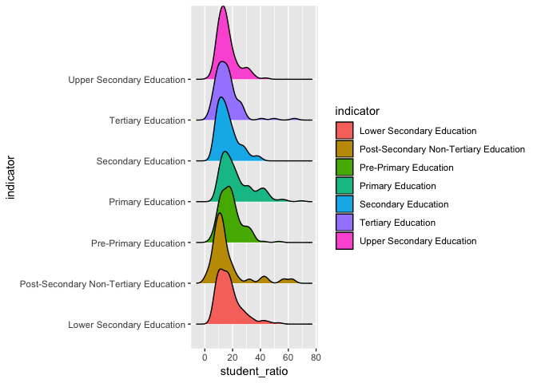
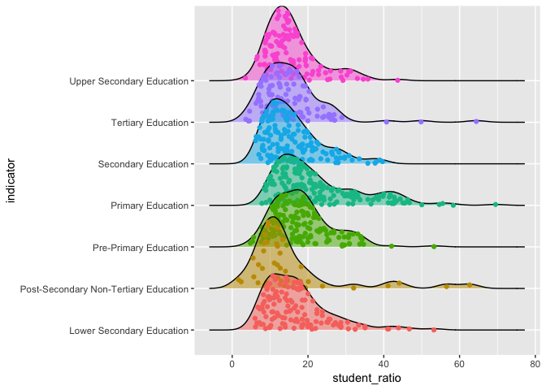
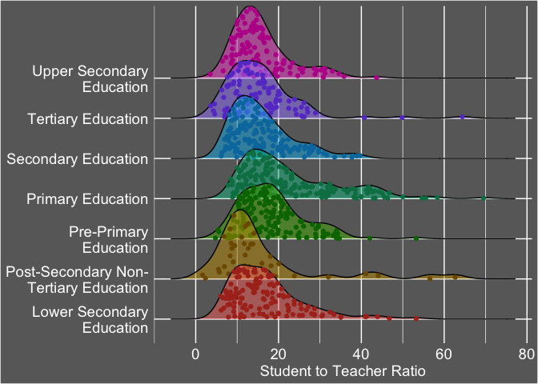
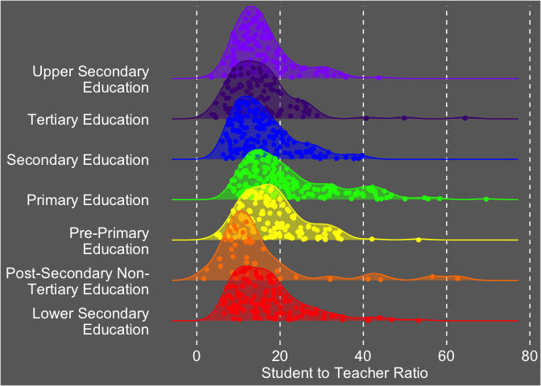
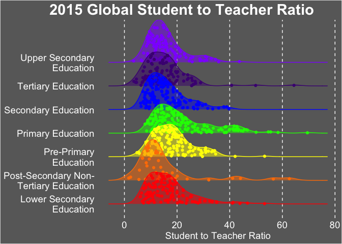

### \#TidyTuesday 05-07-2019 Week 19

This week’s data looks at student teacher ratios across the globe. The
data can be found
[here](https://github.com/rfordatascience/tidytuesday/tree/master/data/2019/2019-05-07).

After messing around with the data for a bit, I decided to focus on the
2015 data. I really wanted to do a ridgeline plot. Using all the data
made things difficult to visualize. 2015 had the most data points so I
went with it.

I used a ridgeline plot with the actual data points plotted in it. Looks
cool & is more informative than only the ridgeline plot. I used the
ggridges R packages.
[Here](https://cran.r-project.org/web/packages/ggridges/vignettes/introduction.html)
is a link to their documentation.

First, let’s download the data we’re going to use. I opted for the
already clean data. The original data is in the repository as well if
you want to work on your data cleaning skills\!

``` bash
curl -o student_teacher_ratio.csv https://raw.githubusercontent.com/rfordatascience/tidytuesday/master/data/2019/2019-05-07/student_teacher_ratio.csv
```

Let’s load the libraries we’ll be using and our data. Then let’s take a
quick peek at the data.

``` r
library(ggridges)
library(tidyverse)
```

    ## ── Attaching packages ────────────────────────────────── tidyverse 1.2.1 ──

    ## ✔ ggplot2 3.1.0       ✔ purrr   0.3.1  
    ## ✔ tibble  2.0.1       ✔ dplyr   0.8.0.1
    ## ✔ tidyr   0.8.3       ✔ stringr 1.4.0  
    ## ✔ readr   1.3.1       ✔ forcats 0.4.0

    ## ── Conflicts ───────────────────────────────────── tidyverse_conflicts() ──
    ## ✖ dplyr::filter()                  masks stats::filter()
    ## ✖ dplyr::lag()                     masks stats::lag()
    ## ✖ ggplot2::scale_discrete_manual() masks ggridges::scale_discrete_manual()

``` r
data <- read_csv("student_teacher_ratio.csv", na = c("", "NA"))
```

    ## Parsed with column specification:
    ## cols(
    ##   edulit_ind = col_character(),
    ##   indicator = col_character(),
    ##   country_code = col_character(),
    ##   country = col_character(),
    ##   year = col_double(),
    ##   student_ratio = col_double(),
    ##   flag_codes = col_character(),
    ##   flags = col_character()
    ## )

``` r
head(data)
```

    ## # A tibble: 6 x 8
    ##   edulit_ind indicator country_code country  year student_ratio flag_codes
    ##   <chr>      <chr>     <chr>        <chr>   <dbl>         <dbl> <chr>     
    ## 1 PTRHC_2    Lower Se… MRT          Maurit…  2013          56.6 <NA>      
    ## 2 PTRHC_2    Lower Se… MRT          Maurit…  2014          51.9 <NA>      
    ## 3 PTRHC_2    Lower Se… MRT          Maurit…  2015          53.2 <NA>      
    ## 4 PTRHC_2    Lower Se… MRT          Maurit…  2016          38.2 <NA>      
    ## 5 PTRHC_1    Primary … COD          Democr…  2012          34.7 <NA>      
    ## 6 PTRHC_1    Primary … COD          Democr…  2013          37.1 <NA>      
    ## # … with 1 more variable: flags <chr>

Everything looks good there\!

Let’s filter our data. I used `filter()` to get all the data from 2015.
Then I used `select()` to get the two columns I’m interested in:
indicator (Education level group) & student\_ratio (Student to teacher
ratio). The lower the student to teacher ratio, the better. Also, there
are some NAs in our data. I used `drop_na()` to remove those from our
data set.

``` r
fin_df <- data %>%
  filter(year == "2015") %>%
  select(indicator, student_ratio) %>%
  drop_na()

head(fin_df)
```

    ## # A tibble: 6 x 2
    ##   indicator                 student_ratio
    ##   <chr>                             <dbl>
    ## 1 Lower Secondary Education         53.2 
    ## 2 Primary Education                 33.2 
    ## 3 Pre-Primary Education             16.7 
    ## 4 Pre-Primary Education              8.73
    ## 5 Primary Education                 17.0 
    ## 6 Upper Secondary Education         33.0

Let’s start with a basic ridgeline plot.

``` r
  ggplot(fin_df, aes(x = student_ratio, y = indicator, fill = indicator)) +
    geom_density_ridges()
```

    ## Picking joint bandwidth of 2.53

<!-- -->

Looks good\! First, I want to remove the legend so I can use the full
plotting space available. I did this in the `theme()` call. Then let’s
add in the points using the aes call inside `geom_density_ridges()`.
Here we can set the transparency (alpha), color, fill, & shape.

``` r
  ggplot(fin_df, aes(x = student_ratio, y = indicator, fill = indicator)) +
    geom_density_ridges(aes(point_color = indicator, point_fill = indicator),
    alpha = .5, point_alpha = 1, jittered_points = TRUE) +
    theme(legend.position = "none")
```

    ## Picking joint bandwidth of 2.53

<!-- -->

Next, I’m going to darken up the points a little bit using
`scale_point_color_hue()`.

``` r
  ggplot(fin_df, aes(x = student_ratio, y = indicator, fill = indicator)) +
    geom_density_ridges(aes(point_color = indicator, point_fill = indicator),
    alpha = .5, point_alpha = 1, jittered_points = TRUE)  +
    scale_point_color_hue(l = 40) +
  theme(legend.position = "none")
```

    ## Picking joint bandwidth of 2.53

<!-- -->

Lately, I feel like everyone has been doing plots with dark backgrounds.
We’re going to try that here\! I picked a dark gray background. I used
`panel.background` & `plot.background` in the `theme()` call to change
the color.

``` r
  ggplot(fin_df, aes(x = student_ratio, y = indicator, fill = indicator)) +
    geom_density_ridges(aes(point_color = indicator, point_fill = indicator),
    alpha = .5, point_alpha = 1, jittered_points = TRUE)  +
    scale_point_color_hue(l = 40) +
  theme(legend.position = "none",
    plot.background = element_rect(fill = c("#696969")),
    panel.background = element_rect(fill = c("#696969")))
```

    ## Picking joint bandwidth of 2.53

<!-- -->

That could work\! Let’s play with it a bit. First off, I’d like to
change the text color & size. All of this can be done in the `theme()`
call. I also removed the tick marks. I added in an `xlab()` call to
change the x axis label. I also used a call to `scale_y_discrete()` to
wrap the y-axis labels. You can play around with the width to figure out
what looks best\!

``` r
ggplot(fin_df, aes(x = student_ratio, y = indicator, fill = indicator)) +
  geom_density_ridges(aes(point_color = indicator, point_fill = indicator), alpha = .5, point_alpha = 1, jittered_points = TRUE)  +
  scale_point_color_hue(l = 40) +
  xlab("Student to Teacher Ratio") +
  theme(legend.position = "none",
    plot.background = element_rect(fill = c("#696969")),
    panel.background = element_rect(fill = c("#696969")),
    axis.text = element_text(color = "white", size = 14),
    axis.title.x = element_text(color = "white", size = 14),
    axis.title.y = element_blank(),
    axis.ticks = element_blank()) +
  scale_y_discrete(labels = function(x) str_wrap(x, width = 20))
```

    ## Picking joint bandwidth of 2.53

<!-- -->

Looks better\! I’d like to change the grid lines as well. I removed the
minor grid lines and the y-axis major grid lines. Then I changed the
x-axis major grid lines to dashed lines instead.

``` r
ggplot(fin_df, aes(x = student_ratio, y = indicator, fill = indicator)) +
  geom_density_ridges(aes(point_color = indicator, point_fill = indicator), alpha = .5, point_alpha = 1, jittered_points = TRUE)  +
  scale_point_color_hue(l = 40) +
  xlab("Student to Teacher Ratio") +
  theme(legend.position = "none",
    plot.background = element_rect(fill = c("#696969")),
    panel.background = element_rect(fill = c("#696969")),
    axis.text = element_text(color = "white", size = 14),
    axis.title.x = element_text(color = "white", size = 14),
    axis.title.y = element_blank(),
    axis.ticks = element_blank(),
    panel.grid.minor = element_blank(),
    panel.grid.major.x = element_line(linetype = "dashed"),
    panel.grid.major.y = element_blank()) +
  scale_y_discrete(labels = function(x) str_wrap(x, width = 20))
```

    ## Picking joint bandwidth of 2.53

<!-- -->

It’s looking better\! I would like to change the color of the ridges. I
used a nice primary school color palette. I felt it fit this graphic
well. I used `scale_fill_manual()` to change the color of the actual
ridges. I used `scale_discrete_manual()` to change the color of the
points inside. I also added `color = indicator` to the aes call inside
`geom_density_ridges()`to remove the black lines at the top of each
ridge. I then added `scale_color_manual()` to make the colors of the
lines match the colors I chose for the ridges.

I used `scale_discrete_manual()` to change the color of the points. I
removed `scale_point_color_hue()` because I didn’t like how it affected
the colors of the points.

``` r
ggplot(fin_df, aes(x = student_ratio, y = indicator, fill = indicator, color = indicator)) +
  geom_density_ridges(aes(point_color = indicator, point_fill = indicator), alpha = .5, point_alpha = 1, jittered_points = TRUE)  +
  xlab("Student to Teacher Ratio") +
  theme(legend.position = "none",
    plot.background = element_rect(fill = c("#696969")),
    panel.background = element_rect(fill = c("#696969")),
    axis.text = element_text(color = "white", size = 14),
    axis.title.x = element_text(color = "white", size = 14),
    axis.title.y = element_blank(),
    axis.ticks = element_blank(),
    panel.grid.minor = element_blank(),
    panel.grid.major.x = element_line(linetype = "dashed"),
    panel.grid.major.y = element_blank()) +
  scale_y_discrete(labels = function(x) str_wrap(x, width = 20)) +
  scale_fill_manual(values = c("#FF0000", "#FF7F00", "#FFFF00", "#00FF00", "#0000FF", "#4B0082", "#8F00FF")) +
  scale_discrete_manual(aesthetics = "point_color", values = c("#FF0000", "#FF7F00", "#FFFF00", "#00FF00", "#0000FF", "#4B0082", "#8F00FF")) +
  scale_color_manual(values = c("#FF0000", "#FF7F00", "#FFFF00", "#00FF00", "#0000FF", "#4B0082", "#8F00FF"))
```

    ## Picking joint bandwidth of 2.53

<!-- -->

Last of all, let’s add a title\! I used `ggtitle()` to add the title.
Then I added `plot.title` to the theme call to adjust the font size,
color, & justification of the title.

``` r
ggplot(fin_df, aes(x = student_ratio, y = indicator, fill = indicator, color = indicator)) +
  geom_density_ridges(aes(point_color = indicator, point_fill = indicator), alpha = .5, point_alpha = 1, jittered_points = TRUE)  +
  xlab("Student to Teacher Ratio") +
  theme(legend.position = "none",
    plot.background = element_rect(fill = c("#696969")),
    panel.background = element_rect(fill = c("#696969")),
    axis.text = element_text(color = "white", size = 14),
    axis.title.x = element_text(color = "white", size = 14),
    axis.title.y = element_blank(),
    axis.ticks = element_blank(),
    panel.grid.minor = element_blank(),
    panel.grid.major.x = element_line(linetype = "dashed"),
    panel.grid.major.y = element_blank(),
    plot.title = element_text(size = 22, color = "white", face = "bold", hjust = 2)) +
  scale_y_discrete(labels = function(x) str_wrap(x, width = 20)) +
  scale_fill_manual(values = c("#FF0000", "#FF7F00", "#FFFF00", "#00FF00", "#0000FF", "#4B0082", "#8F00FF")) +
  scale_discrete_manual(aesthetics = "point_color", values = c("#FF0000", "#FF7F00", "#FFFF00", "#00FF00", "#0000FF", "#4B0082", "#8F00FF")) +
  scale_color_manual(values = c("#FF0000", "#FF7F00", "#FFFF00", "#00FF00", "#0000FF", "#4B0082", "#8F00FF")) +
  ggtitle("2015 Global Student to Teacher Ratio")
```

    ## Picking joint bandwidth of 2.53

<!-- -->

I like this\! If you have any feedback/questions, please feel free to
create an issue or pull request. You can always connect with me on
[Twitter](https://twitter.com/sapo83).
