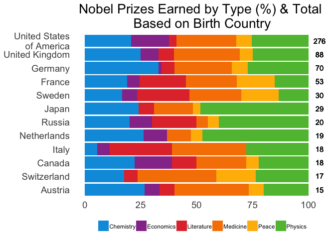

### \#TidyTuesday 05-14-2019 Week 20

This week’s data looks at Nobel Prize winners & the associated metadata.
I decided to focus on the birth country of each winner. I thought this
was a good chance to calculate some percents & used a stacked bar chart.

Let’s start by loading the tidyverse library & reading in our data.

``` r
library(tidyverse)
```

    ## ── Attaching packages ────────────────────────────────── tidyverse 1.2.1 ──

    ## ✔ ggplot2 3.1.0       ✔ purrr   0.3.1  
    ## ✔ tibble  2.0.1       ✔ dplyr   0.8.0.1
    ## ✔ tidyr   0.8.3       ✔ stringr 1.4.0  
    ## ✔ readr   1.3.1       ✔ forcats 0.4.0

    ## Warning: package 'tibble' was built under R version 3.5.2

    ## Warning: package 'tidyr' was built under R version 3.5.2

    ## Warning: package 'purrr' was built under R version 3.5.2

    ## Warning: package 'dplyr' was built under R version 3.5.2

    ## Warning: package 'stringr' was built under R version 3.5.2

    ## Warning: package 'forcats' was built under R version 3.5.2

    ## ── Conflicts ───────────────────────────────────── tidyverse_conflicts() ──
    ## ✖ dplyr::filter() masks stats::filter()
    ## ✖ dplyr::lag()    masks stats::lag()

``` r
nobel_winners <- read_csv("https://raw.githubusercontent.com/rfordatascience/tidytuesday/master/data/2019/2019-05-14/nobel_winners.csv")
```

    ## Parsed with column specification:
    ## cols(
    ##   prize_year = col_double(),
    ##   category = col_character(),
    ##   prize = col_character(),
    ##   motivation = col_character(),
    ##   prize_share = col_character(),
    ##   laureate_id = col_double(),
    ##   laureate_type = col_character(),
    ##   full_name = col_character(),
    ##   birth_date = col_date(format = ""),
    ##   birth_city = col_character(),
    ##   birth_country = col_character(),
    ##   gender = col_character(),
    ##   organization_name = col_character(),
    ##   organization_city = col_character(),
    ##   organization_country = col_character(),
    ##   death_date = col_date(format = ""),
    ##   death_city = col_character(),
    ##   death_country = col_character()
    ## )

``` r
head(nobel_winners)
```

    ## # A tibble: 6 x 18
    ##   prize_year category prize motivation prize_share laureate_id
    ##        <dbl> <chr>    <chr> <chr>      <chr>             <dbl>
    ## 1       1901 Chemist… The … "\"in rec… 1/1                 160
    ## 2       1901 Literat… The … "\"in spe… 1/1                 569
    ## 3       1901 Medicine The … "\"for hi… 1/1                 293
    ## 4       1901 Peace    The … <NA>       1/2                 462
    ## 5       1901 Peace    The … <NA>       1/2                 463
    ## 6       1901 Physics  The … "\"in rec… 1/1                   1
    ## # … with 12 more variables: laureate_type <chr>, full_name <chr>,
    ## #   birth_date <date>, birth_city <chr>, birth_country <chr>,
    ## #   gender <chr>, organization_name <chr>, organization_city <chr>,
    ## #   organization_country <chr>, death_date <date>, death_city <chr>,
    ## #   death_country <chr>

Data looks ok. Let’s start by finding the total number of Nobel Prizes
awarded by birth country. First, I used `select()` to keep only the
birth country. I dropped all NAs to make life easier\! Then I grouped by
birth country & used `summarise()` to get the total for each country. I
used `top_n()` to keep the 12 countries with the highest totals. Last of
all, I saved these 12 countries into a list for later use.

``` r
count_list <- nobel_winners %>%
  select(birth_country) %>%
  drop_na() %>%
  group_by(birth_country) %>%
  summarise(total = n()) %>%
  top_n(12, total)

country_list <- count_list$birth_country

head(country_list)
```

    ## [1] "Austria" "Canada"  "France"  "Germany" "Italy"   "Japan"

Next, I’m going to filter the data & calculate our percents. I used
`select()` to get the columnds I needed. I used `filter()` to keep only
the countries in our top 12 list. I grouped by birth country & category
& used `summarise()` to get the count of each type of Nobel Prize for
each country. I used right join to add the column with the total number
of Prizes for each country. Finally, I used `mutate()` to calculate the
percent for each type of Nobel Prize.

``` r
filter_df <- nobel_winners %>%
  select(birth_country, category) %>%
  filter(birth_country %in% country_list) %>%
  group_by(birth_country, category) %>%
  summarise(count = n()) %>%
  right_join(count_list) %>%
  mutate(pct = (count/total) * 100)
```

    ## Joining, by = "birth_country"

``` r
head(filter_df)
```

    ## # A tibble: 6 x 5
    ## # Groups:   birth_country [1]
    ##   birth_country category   count total   pct
    ##   <chr>         <chr>      <int> <int> <dbl>
    ## 1 Austria       Chemistry      4    15 26.7 
    ## 2 Austria       Economics      1    15  6.67
    ## 3 Austria       Literature     1    15  6.67
    ## 4 Austria       Medicine       5    15 33.3 
    ## 5 Austria       Peace          1    15  6.67
    ## 6 Austria       Physics        3    15 20

For the plot, I want to change the order of countries to reflect the
total numebr of Nobel Prizes earned. I used `reorder()` to set this
order.

``` r
filter_df$birth_country <- reorder(filter_df$birth_country, filter_df$total)
```

I’m going to work my way through this line by line.

`geom_bar()` sets the fill by type of Nobel Prize. I used `fct_rev()` to
get alphabetical order from left to right.

`geom_text()` adds the total number of Prizes on the right hand side of
the bar.

`coord_flip()` changes the plot from vertical bars to horizontal bars.

`scale_x_discrete()` sets the length of the word wrap on the y-axis of
the final plot.

`scale_fill_manual()` sets the colors for each category.

`guides()` reverses the order of the legend so it matches the order of
the plot.

`ggtitle()` sets the title of the plot.

`theme()` does the following:

  - move legend to bottom of plot
  - remove legend title
  - remove axes title
  - make axis text font larger
  - remove panel background
  - remove axis ticks
  - format plot title

<!-- end list -->

``` r
ggplot(filter_df) +
  geom_bar(aes(x = birth_country, y = pct, fill = fct_rev(category)), stat = "identity") +
  geom_text(aes(x = birth_country, y = 105, label = total)) +
  coord_flip() +
  scale_x_discrete(labels = function(x) str_wrap(x, width = 15)) +
  scale_fill_manual(values = c("#5EBD3E", "#FFB900", "#F78200", "#E23838", "#973999", "#009CDF")) +
  guides(fill = guide_legend(reverse = TRUE, ncol = 6)) +
  ggtitle("Nobel Prizes Earned by Type (%) & Total \nBased on Birth Country") +
  theme(legend.position = "bottom",
    legend.title = element_blank(),
    axis.title = element_blank(),
    axis.text = element_text(size = 14),
    panel.background = element_blank(),
    axis.ticks = element_blank(),
    plot.title = element_text(size = 20, hjust = 0.5))
```

<!-- -->

Looks good\! If you have any feedback/questions, please feel free to
create an issue or pull request. You can always connect with me on
[Twitter](https://twitter.com/sapo83).
