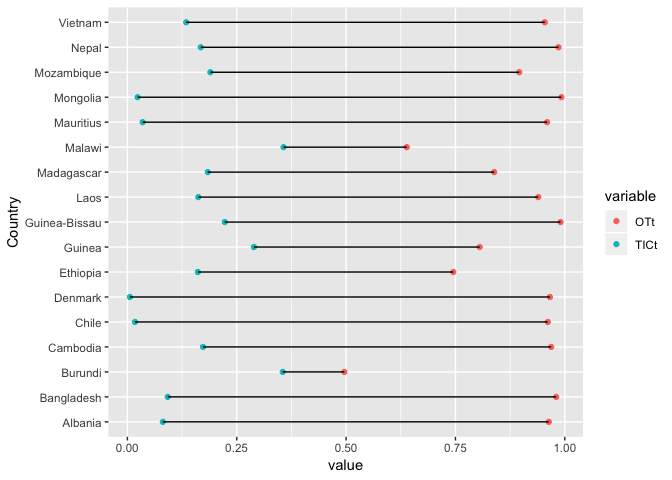
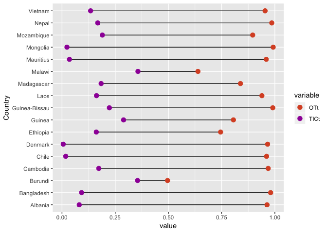
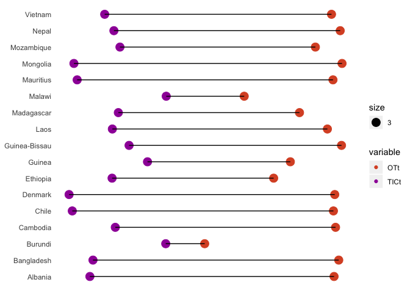
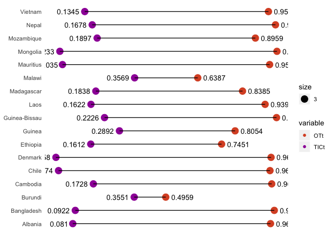
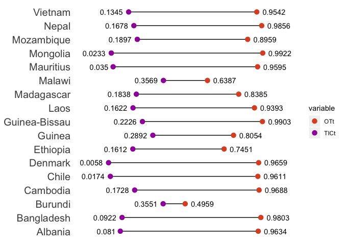
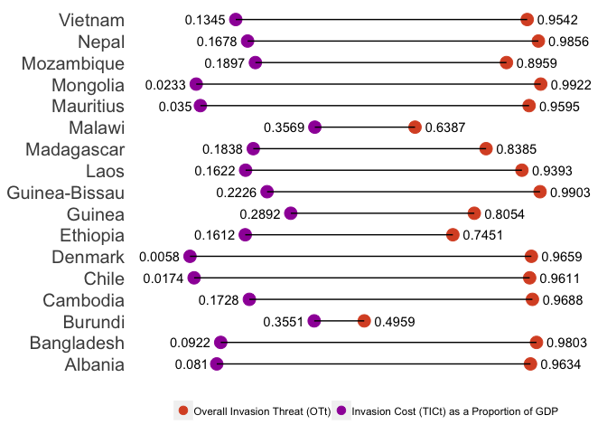

### \#TidyTuesday 9-25-18 Week 26

This week’s data explores global invasion threat & cost. The data can be
found
[here](https://github.com/rfordatascience/tidytuesday/tree/master/data/2018-09-25).
I used the tables in the “raw” folder.

This week, we’re going to do a Cleveland dot plot\!

First, let’s load the libraries we’ll be using & read in our data. We’ll
use head() to take a quick peek at the
    data.

``` r
library(tidyverse)
```

    ## ── Attaching packages ────────────────────────────────── tidyverse 1.2.1 ──

    ## ✔ ggplot2 3.0.0     ✔ purrr   0.2.5
    ## ✔ tibble  1.4.2     ✔ dplyr   0.7.6
    ## ✔ tidyr   0.8.1     ✔ stringr 1.3.1
    ## ✔ readr   1.1.1     ✔ forcats 0.3.0

    ## Warning: package 'dplyr' was built under R version 3.5.1

    ## ── Conflicts ───────────────────────────────────── tidyverse_conflicts() ──
    ## ✖ dplyr::filter() masks stats::filter()
    ## ✖ dplyr::lag()    masks stats::lag()

``` r
library(reshape2)
```

    ## 
    ## Attaching package: 'reshape2'

    ## The following object is masked from 'package:tidyr':
    ## 
    ##     smiths

``` r
data <- read_csv("table1.csv")
```

    ## Warning: Duplicated column names deduplicated: 'Rank' => 'Rank_1' [4],
    ## 'Country' => 'Country_1' [5], 'OTt' => 'OTt_1' [6], 'Rank' => 'Rank_2' [7],
    ## 'Country' => 'Country_2' [8], 'OTt' => 'OTt_2' [9]

    ## Parsed with column specification:
    ## cols(
    ##   Rank = col_integer(),
    ##   Country = col_character(),
    ##   OTt = col_double(),
    ##   Rank_1 = col_integer(),
    ##   Country_1 = col_character(),
    ##   OTt_1 = col_double(),
    ##   Rank_2 = col_integer(),
    ##   Country_2 = col_character(),
    ##   OTt_2 = col_double()
    ## )

``` r
head(data)
```

    ## # A tibble: 6 x 9
    ##    Rank Country      OTt Rank_1 Country_1   OTt_1 Rank_2 Country_2   OTt_2
    ##   <int> <chr>      <dbl>  <int> <chr>       <dbl>  <int> <chr>       <dbl>
    ## 1     1 Mongolia   0.992     43 Hungary     0.788     85 Belgium     0.603
    ## 2     2 Guinea-Bi… 0.990     44 United Kin… 0.779     86 Portugal    0.600
    ## 3     3 Nepal      0.986     45 Latvia      0.776     87 Germany     0.596
    ## 4     4 Bangladesh 0.980     46 Tunisia     0.769     88 Romania     0.596
    ## 5     5 Cambodia   0.969     47 Jamaica     0.767     89 Colombia    0.592
    ## 6     6 Denmark    0.966     48 Estonia     0.762     90 Equatorial… 0.591

We can see from the head() function that there are three sets of data
per row. What w’re going to do is split the entire data frame into three
smaller ones. The first data frame (df1) is the first three columns of
the original data frame. The second data frame (df2) is the 4th through
6th column. The third data frame (df3) is the 7th through 9th column.

Then we use rename() to name the columns in the seocnd & third data
frames to match the first data frame. Last of all, we combine all three
data frames using rbind.

We use head() to give our new data frame a quick once over.

``` r
df1 <- data %>%
  select(Rank, Country, OTt)

df2 <- data %>%
  select(Rank_1, Country_1, OTt_1) %>%
  rename(Rank = Rank_1, Country = Country_1, OTt = OTt_1)

df3 <- data %>%
  select(Rank_2, Country_2, OTt_2) %>%
  rename(Rank = Rank_2, Country = Country_2, OTt = OTt_2)

table1_df <- rbind(df1, df2, df3)

head(table1_df)
```

    ## # A tibble: 6 x 3
    ##    Rank Country         OTt
    ##   <int> <chr>         <dbl>
    ## 1     1 Mongolia      0.992
    ## 2     2 Guinea-Bissau 0.990
    ## 3     3 Nepal         0.986
    ## 4     4 Bangladesh    0.980
    ## 5     5 Cambodia      0.969
    ## 6     6 Denmark       0.966

Another way to make sure that things worked how we wanted is by using
nrow(). nrow() returns the number of rows in a tibble. ncol() returns
the number of columns in a tibble.

Here, we can use nrow() on the three smaller data frames. Then we use
nrow() on the combined data frame. The number of rows in the three
smaller data frames should equal the number of rows in the combined data
frame.

``` r
nrow(df1)
```

    ## [1] 42

``` r
nrow(df2)
```

    ## [1] 42

``` r
nrow(df3)
```

    ## [1] 42

``` r
nrow(table1_df)
```

    ## [1] 126

42 + 42 + 42 = 126. Everything checks out so far\!

Let’s move onto table 3. We’ll read in the data using read\_csv() & then
use head to look at
    it.

``` r
data3 <- read_csv("table3.csv")
```

    ## Warning: Missing column names filled in: 'X1' [1], 'X2' [2], 'X4' [4],
    ## 'X6' [6], 'X7' [7], 'X9' [9], 'X11' [11], 'X12' [12], 'X14' [14]

    ## Warning: Duplicated column names deduplicated: 'TICt (millions' =>
    ## 'TICt (millions_1' [8], 'proportion of' => 'proportion of_1' [10], 'TICt
    ## (millions' => 'TICt (millions_2' [13], 'proportion of' => 'proportion
    ## of_2' [15]

    ## Parsed with column specification:
    ## cols(
    ##   X1 = col_character(),
    ##   X2 = col_character(),
    ##   `TICt  (millions` = col_character(),
    ##   X4 = col_character(),
    ##   `proportion of` = col_character(),
    ##   X6 = col_character(),
    ##   X7 = col_character(),
    ##   `TICt  (millions_1` = col_character(),
    ##   X9 = col_character(),
    ##   `proportion of_1` = col_character(),
    ##   X11 = col_character(),
    ##   X12 = col_character(),
    ##   `TICt  (millions_2` = col_character(),
    ##   X14 = col_character(),
    ##   `proportion of_2` = col_character()
    ## )

``` r
head(data3)
```

    ## # A tibble: 6 x 15
    ##   X1    X2    `TICt  (million… X4    `proportion of` X6    X7   
    ##   <chr> <chr> <chr>            <chr> <chr>           <chr> <chr>
    ## 1 Rank… <NA>  US$)             mean… GDP             Rank… <NA> 
    ## 2 1 Ma… <NA>  $1,071           $3,0… 0.3569          43 P… <NA> 
    ## 3 2 Bu… <NA>  $398             $1,1… 0.3551          44 M… <NA> 
    ## 4 3 Gu… <NA>  $978             $3,3… 0.2892          45 N… <NA> 
    ## 5 4 Gu… <NA>  $114             $513  0.2226          46 C… <NA> 
    ## 6 5 Mo… <NA>  $1,218           $6,4… 0.1897          47 I… <NA> 
    ## # ... with 8 more variables: `TICt (millions_1` <chr>, X9 <chr>,
    ## #   `proportion of_1` <chr>, X11 <chr>, X12 <chr>, `TICt
    ## #   (millions_2` <chr>, X14 <chr>, `proportion of_2` <chr>

Well that looks… messy. It looks like there are actually two header rows
here. Let’s read in our data a little differently to take care of that.
We can add a skip option to our read\_csv() call. Here we specify “skip
= 2”. We’ll also use “col\_names = FALSE”. This tells read\_csv() that
there are no column names.

``` r
data3 <- read_csv("table3.csv", skip = 2, col_names = FALSE)
```

    ## Parsed with column specification:
    ## cols(
    ##   X1 = col_character(),
    ##   X2 = col_character(),
    ##   X3 = col_character(),
    ##   X4 = col_character(),
    ##   X5 = col_double(),
    ##   X6 = col_character(),
    ##   X7 = col_character(),
    ##   X8 = col_character(),
    ##   X9 = col_character(),
    ##   X10 = col_double(),
    ##   X11 = col_character(),
    ##   X12 = col_character(),
    ##   X13 = col_character(),
    ##   X14 = col_character(),
    ##   X15 = col_double()
    ## )

``` r
head(data3)
```

    ## # A tibble: 6 x 15
    ##   X1    X2    X3    X4       X5 X6    X7    X8    X9       X10 X11   X12  
    ##   <chr> <chr> <chr> <chr> <dbl> <chr> <chr> <chr> <chr>  <dbl> <chr> <chr>
    ## 1 1 Ma… <NA>  $1,0… $3,0… 0.357 43 P… <NA>  $4,8… $113… 0.0428 85 L… <NA> 
    ## 2 2 Bu… <NA>  $398  $1,1… 0.355 44 M… <NA>  $2,5… $60,… 0.042  86 C… <NA> 
    ## 3 3 Gu… <NA>  $978  $3,3… 0.289 45 N… <NA>  $264  $6,3… 0.0415 87 P… <NA> 
    ## 4 4 Gu… <NA>  $114  $513  0.223 46 C… <NA>  $41   $1,0… 0.0406 88 S… <NA> 
    ## 5 5 Mo… <NA>  $1,2… $6,4… 0.190 47 I… <NA>  $33,… $844… 0.0392 89 J… <NA> 
    ## 6 6 Ma… <NA>  $1,0… $5,8… 0.184 48 B… <NA>  $42   $1,1… 0.0384 90 P… <NA> 
    ## # ... with 3 more variables: X13 <chr>, X14 <chr>, X15 <dbl>

We got rid of the two header rows but not we have some columns that are
all NAs. We’ll use select() to get rid of those. By adding a minus sign
(“-”) before a column name in select(), we can remove that column from
the data frame.

``` r
newdata3 <- data3 %>%
  select(-X2, -X7, -X12)

head(newdata3)
```

    ## # A tibble: 6 x 12
    ##   X1    X3    X4       X5 X6    X8    X9       X10 X11   X13   X14  
    ##   <chr> <chr> <chr> <dbl> <chr> <chr> <chr>  <dbl> <chr> <chr> <chr>
    ## 1 1 Ma… $1,0… $3,0… 0.357 43 P… $4,8… $113… 0.0428 85 L… $187  $17,…
    ## 2 2 Bu… $398  $1,1… 0.355 44 M… $2,5… $60,… 0.042  86 C… $1,3… $129…
    ## 3 3 Gu… $978  $3,3… 0.289 45 N… $264  $6,3… 0.0415 87 P… $161  $16,…
    ## 4 4 Gu… $114  $513  0.223 46 C… $41   $1,0… 0.0406 88 S… $573  $59,…
    ## 5 5 Mo… $1,2… $6,4… 0.190 47 I… $33,… $844… 0.0392 89 J… $116  $13,…
    ## 6 6 Ma… $1,0… $5,8… 0.184 48 B… $42   $1,1… 0.0384 90 P… $2,4… $306…
    ## # ... with 1 more variable: X15 <dbl>

Our next problem is that the rank & the country are in the same column.
We can use separate() to fix this problem. We’ll start by separating the
first column. There are a couple parts to the separate() function.

  - specify the column name
  - specify separator using “sep =”
  - into takes a vector with which you can name the new columns created
  - extra = “merge” tells R to keep the extra values in the second
    column created.

<!-- end list -->

``` r
newdata3_1 <- newdata3 %>%
  separate(X1, sep = " ", into = c("Rank", "Country"), extra = "merge") %>%
  separate(X6, sep = " ", into = c("Rank_1", "Country_1"), extra = "merge") %>%
  separate(X11, sep = " ", into = c("Rank_2", "Country_2"), extra = "merge")

head(newdata3_1)
```

    ## # A tibble: 6 x 15
    ##   Rank  Country X3    X4       X5 Rank_1 Country_1 X8    X9       X10
    ##   <chr> <chr>   <chr> <chr> <dbl> <chr>  <chr>     <chr> <chr>  <dbl>
    ## 1 1     Malawi  $1,0… $3,0… 0.357 43     Philippi… $4,8… $113… 0.0428
    ## 2 2     Burundi $398  $1,1… 0.355 44     Morocco   $2,5… $60,… 0.042 
    ## 3 3     Guinea  $978  $3,3… 0.289 45     Nicaragua $264  $6,3… 0.0415
    ## 4 4     Guinea… $114  $513  0.223 46     Cape Ver… $41   $1,0… 0.0406
    ## 5 5     Mozamb… $1,2… $6,4… 0.190 47     India     $33,… $844… 0.0392
    ## 6 6     Madaga… $1,0… $5,8… 0.184 48     Belize    $42   $1,1… 0.0384
    ## # ... with 5 more variables: Rank_2 <chr>, Country_2 <chr>, X13 <chr>,
    ## #   X14 <chr>, X15 <dbl>

Now, we are interested in the columns that represent total invasion cost
as a proportion of mean GDP. We’ll use select() to keep only the columns
we are interested in. To maintain the order of our columns, we going to
use a minus sign (-) in our select statement to remove the columns we no
longer want.

Also, let’s rename the unnamed columns we are keeping. We can use
rename() to do this.

``` r
newdata3_1_filter <- newdata3_1 %>%
  select(-X3, -X4, -X8, -X9, -X13, -X14) %>%
  rename(TICt = X5, TICt_1 = X10, TICt_2 = X15)

head(newdata3_1_filter)
```

    ## # A tibble: 6 x 9
    ##   Rank  Country    TICt Rank_1 Country_1  TICt_1 Rank_2 Country_2   TICt_2
    ##   <chr> <chr>     <dbl> <chr>  <chr>       <dbl> <chr>  <chr>        <dbl>
    ## 1 1     Malawi    0.357 43     Philippin… 0.0428 85     Latvia     0.0107 
    ## 2 2     Burundi   0.355 44     Morocco    0.042  86     Czech Rep… 0.0103 
    ## 3 3     Guinea    0.289 45     Nicaragua  0.0415 87     Panama     0.0099 
    ## 4 4     Guinea-B… 0.223 46     Cape Verde 0.0406 88     Slovakia   0.00960
    ## 5 5     Mozambiq… 0.190 47     India      0.0392 89     Jordan     0.0084 
    ## 6 6     Madagasc… 0.184 48     Belize     0.0384 90     Poland     0.008

Now we’re going to split our data frame like we did the first time &
then bind it back together.

``` r
df3_1 <- newdata3_1_filter %>%
  select(Rank, Country, TICt)

df3_2 <- newdata3_1_filter %>%
  select(Rank_1, Country_1, TICt_1) %>%
  rename(Rank = Rank_1, Country = Country_1, TICt = TICt_1)

df3_3 <- newdata3_1_filter %>%
  select(Rank_2, Country_2, TICt_2) %>%
  rename(Rank = Rank_2, Country = Country_2, TICt = TICt_2)

table3_df <- rbind(df3_1, df3_2, df3_3)

head(table3_df)
```

    ## # A tibble: 6 x 3
    ##   Rank  Country        TICt
    ##   <chr> <chr>         <dbl>
    ## 1 1     Malawi        0.357
    ## 2 2     Burundi       0.355
    ## 3 3     Guinea        0.289
    ## 4 4     Guinea-Bissau 0.223
    ## 5 5     Mozambique    0.190
    ## 6 6     Madagascar    0.184

There are 42 countries in this list. I’m going to filter each table by
the top 10 values. Then I’ll use select to get keep only the “Country”
column. I’ll then combine these two lists & use distinct() to make a
unique list.

``` r
tbl1_10 <- table1_df %>%
  top_n(10, OTt) %>%
  select(Country)

head(tbl1_10)
```

    ## # A tibble: 6 x 1
    ##   Country      
    ##   <chr>        
    ## 1 Mongolia     
    ## 2 Guinea-Bissau
    ## 3 Nepal        
    ## 4 Bangladesh   
    ## 5 Cambodia     
    ## 6 Denmark

``` r
tbl3_10 <- table3_df %>%
  top_n(10, TICt) %>%
  select(Country)

head(tbl3_10)
```

    ## # A tibble: 6 x 1
    ##   Country      
    ##   <chr>        
    ## 1 Malawi       
    ## 2 Burundi      
    ## 3 Guinea       
    ## 4 Guinea-Bissau
    ## 5 Mozambique   
    ## 6 Madagascar

``` r
final_list <- rbind(tbl1_10, tbl3_10) %>%
  distinct()
```

Last of all, we’re going to combine our two data frames (table1\_df &
table3\_df) so we can start making our plot. First, we use full\_join()
to combine the tables. Then we use filter() to keep only the countries
in our final list. We can use “%in%” to select only the countries that
appear in our list.

We’re also going to go ahead & drop our rank columns because we won’t be
needing them for the final plot. Finally, we’re going to melt the data
frame to make it easier to plot.

``` r
plotdf <- full_join(table1_df, table3_df, by = "Country") %>%
  filter(Country %in% final_list$Country) %>%
  select(-contains("Rank")) %>%
  melt()
```

    ## Using Country as id variables

``` r
head(plotdf)
```

    ##         Country variable  value
    ## 1      Mongolia      OTt 0.9922
    ## 2 Guinea-Bissau      OTt 0.9903
    ## 3         Nepal      OTt 0.9856
    ## 4    Bangladesh      OTt 0.9803
    ## 5      Cambodia      OTt 0.9688
    ## 6       Denmark      OTt 0.9659

Let’s start plotting our figure\! The hallmark of a Cleveland dot plot
is two values (points) connected by a line. We use geom\_point() to plot
each value. We use variable to color the values by group. Then we use
geom\_line() to connect our two points together.

``` r
ggplot(plotdf) +
  geom_point(aes(x = value, y = Country, color = variable)) +
  geom_line(aes(x = value, y = Country))
```

<!-- -->

Looks good so far\! First, let’s change up the colors & make the points
bigger

``` r
ggplot(plotdf) +
  geom_point(aes(x = value, y = Country, color = variable, size = 3)) +
  geom_line(aes(x = value, y = Country)) +
  scale_color_manual(values = c("#da532c", "#9f00a7"))
```

<!-- -->

I’m liking that. I want to make the plot a bit cleaner by removing the
x-axis. In lieu of the x-axis, I’m going to put labels next to each
point with their values. I added the theme() call. Inside the theme()
call, I used “axis.title” to remove the titles of both axes. I used
“axis.ticks” to remove the tick marks from both axes. I used
“axis.text.x” to remove the tick mark labels. I set all three of these
elements to “element\_blank()”. Lastly, I removed the background using
“panel.background”.

``` r
ggplot(plotdf) +
  geom_point(aes(x = value, y = Country, color = variable, size = 3)) +
  geom_line(aes(x = value, y = Country)) +
  scale_color_manual(values = c("#da532c", "#9f00a7")) +
  theme(axis.title = element_blank(),
    axis.ticks = element_blank(),
    axis.text.x = element_blank(),
    panel.background = element_blank())
```

<!-- -->

Now, I want to add a label next to each of the points. I want the TICt
labels to be on the left side of the point & I want the OTt labels to be
on the right side of the point. The key here is to use two separate
geom\_text() calls. In the geom\_text() call, you can specify your data
& filter it to only include the values you want. Example: In the first
geom\_text() call, I specificed “plotdf” as my data source & then
filtered it by “TICt” to only label those points. I also used hjust to
determine where the points were plotted. I repeated this procedure with
the “OTt” labels.

``` r
ggplot(plotdf) +
  geom_point(aes(x = value, y = Country, color = variable, size = 3)) +
  geom_line(aes(x = value, y = Country)) +
  geom_text(data = plotdf %>%
    filter(variable == "TICt"), aes(x = value, y = Country, label = value), hjust = 1.25) +
  geom_text(data = plotdf %>%
    filter(variable == "OTt"), aes(x = value, y = Country, label = value), hjust = -.25) +
  scale_color_manual(values = c("#da532c", "#9f00a7")) +
  theme(axis.title = element_blank(),
    axis.ticks = element_blank(),
    axis.text.x = element_blank(),
    panel.background = element_blank())
```

<!-- -->

I like the labels but we can’t see some of them\! We can widen the
x-axis to fix this issue. I used xlim() to change the limits on the
x-axis. I added 0.1 in each direction to make enough room for the
labels.

I also bumped up the font size on the y-axis labels. I did this using
“axis.text.y” in the theme() call.

``` r
ggplot(plotdf) +
  geom_point(aes(x = value, y = Country, color = variable, size = 3)) +
  geom_line(aes(x = value, y = Country)) +
  geom_text(data = plotdf %>%
    filter(variable == "TICt"), aes(x = value, y = Country, label = value), hjust = 1.25) +
  geom_text(data = plotdf %>%
    filter(variable == "OTt"), aes(x = value, y = Country, label = value), hjust = -.25) +
  xlim(-0.1,1.1) +
  scale_color_manual(values = c("#da532c", "#9f00a7")) +
  theme(axis.title = element_blank(),
    axis.ticks = element_blank(),
    axis.text.x = element_blank(),
    panel.background = element_blank(),
    axis.text.y = element_text(size = 15))
```

<!-- -->

Last thing I want to fix is the legend. First I want to move the legend
to the bottom of the plot. This can be done inside the theme() call
using legend.position = “bottom”. I removed the legend title using
“legend.title”. Then I removed the size legend using scale\_size(). I
changed the labels for the legend inside the scale\_color\_manual()
call. I changed the dot size inside the guides() call.

``` r
ggplot(plotdf) +
  geom_point(aes(x = value, y = Country, color = variable, size = 3)) +
  geom_line(aes(x = value, y = Country)) +
  geom_text(data = plotdf %>%
    filter(variable == "TICt"), aes(x = value, y = Country, label = value), hjust = 1.25) +
  geom_text(data = plotdf %>%
    filter(variable == "OTt"), aes(x = value, y = Country, label = value), hjust = -.25) +
  xlim(-0.1,1.1) +
  scale_color_manual(values = c("#da532c", "#9f00a7"), labels = c("Overall Invasion Threat (OTt)", "Invasion Cost (TICt) as a Proportion of GDP")) +
  scale_size(guide = "none") +
  guides(colour = guide_legend(override.aes = list(size=3))) +
  theme(legend.position = "bottom",
    legend.title = element_blank(),
    axis.title = element_blank(),
    axis.ticks = element_blank(),
    axis.text.x = element_blank(),
    panel.background = element_blank(),
    axis.text.y = element_text(size = 15))
```

<!-- -->

Looks great\! If you have any questions or comments, feel feel to get in
touch with me via [Twitter](https://twitter.com/sapo83).
