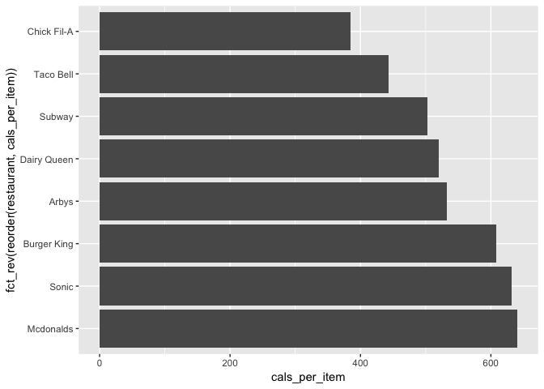
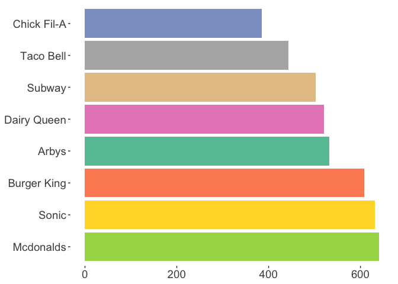

### \#TidyTuesday 9-4-18 Week 23

This week’s data is fast food nutritional data. The data can be found
[here](https://github.com/rfordatascience/tidytuesday/blob/master/data/2018-09-04/fastfood_calories.csv).

First, let’s load the tidyverse library & read in our data.

``` r
library(tidyverse)

data <- read_csv("fastfood_calories.csv")
```

    ## Warning: Missing column names filled in: 'X1' [1]

    ## Parsed with column specification:
    ## cols(
    ##   X1 = col_integer(),
    ##   restaurant = col_character(),
    ##   item = col_character(),
    ##   calories = col_integer(),
    ##   cal_fat = col_integer(),
    ##   total_fat = col_integer(),
    ##   sat_fat = col_double(),
    ##   trans_fat = col_double(),
    ##   cholesterol = col_integer(),
    ##   sodium = col_integer(),
    ##   total_carb = col_integer(),
    ##   fiber = col_integer(),
    ##   sugar = col_integer(),
    ##   protein = col_integer(),
    ##   vit_a = col_integer(),
    ##   vit_c = col_integer(),
    ##   calcium = col_integer(),
    ##   salad = col_character()
    ## )

I want to look at the average calories per each item for each
restaurant.

First, we use select() to pick the columns we need. For this graphic, we
need the restaurant, item, & calories column.

Then we need to group out data by restaurant using group\_by().

We can use summarise() to find the total number of items for each
restaurant & to find total number of calories for all the items
combined.

Last of all, we use mutate() to get the average number of calories per
item for each restaurant.

Using head(), we can take a quick peek at the data to make sure
everything looks good\!

``` r
data1 <- data %>%
  select(restaurant, item, calories) %>%
  group_by(restaurant) %>%
  summarise(count = n(), total_cals = sum(calories)) %>%
  mutate(cals_per_item = total_cals/count)

head(data1)
```

    ## # A tibble: 6 x 4
    ##   restaurant  count total_cals cals_per_item
    ##   <chr>       <int>      <int>         <dbl>
    ## 1 Arbys          55      29300          533.
    ## 2 Burger King    70      42600          609.
    ## 3 Chick Fil-A    27      10380          384.
    ## 4 Dairy Queen    42      21850          520.
    ## 5 Mcdonalds      57      36500          640.
    ## 6 Sonic          53      33480          632.

Now let’s plot this data\! We’ll start with a basic bar plot.

``` r
ggplot(data1) +
  geom_col(aes(restaurant, cals_per_item))
```

<!-- -->

Using the most basic plot is a good way to make sure that the graphic is
showing what you think it should. No sense trying to make something look
pretty if it’s not informative\!

Let’s clean it up\! We’re going to start by using coord\_flip() to make
the direction of the bars horizontal instead of vertical.

``` r
ggplot(data1) +
  geom_col(aes(restaurant, cals_per_item)) +
  coord_flip()
```

<!-- -->

I would like to reorder the x-axis (now our y-axis). I want the
restaurant with the lowest acoumnt of calories per item on the top & the
restaurant with the highest amount of calories per item on the bottom.

This is a two step process. First, we reorder the x-axis using
reorder(). The format for this command is
reorder(item\_to\_be\_reordered, value\_to\_reorder\_by). Here our
reorder command is reorder(restaurant, cals\_per\_item). This gives us
an axis in the opposite order we want (high value on top, low value on
bottom).

The next step is to use fct\_rev() to reverse the order. fct\_rev() is
found in the forcats packages which is a part of the tidyverse library.
Let’s see how it looks\!

``` r
ggplot(data1) +
  geom_col(aes(fct_rev(reorder(restaurant, cals_per_item)), cals_per_item)) +
  coord_flip()
```

<!-- -->

Let’s do some more cleaning. Let’s remove the titles from both axes &
bump up the font size on the axis tick mark labels.

``` r
ggplot(data1) +
  geom_col(aes(fct_rev(reorder(restaurant, cals_per_item)), cals_per_item)) +
  coord_flip() +
  theme(axis.title = element_blank(), axis.text = element_text(size = 14))
```

<!-- -->

Let’s add some color. For this, we can use scale\_fill\_brewer. I picked
“Set2” because I like the pastels. I also added “fill = restaurant” to
change the color of the bars. This will create a legend. I added
‘legend.position = “none”’ to remove the legend.

Next I want to remove the background panel, grid & border. For this, I
added a couple items to the theme call.

``` r
ggplot(data1) +
  geom_col(aes(fct_rev(reorder(restaurant, cals_per_item)), cals_per_item, fill = restaurant)) +
  coord_flip() +
  theme(legend.position = "none",
    axis.title = element_blank(),
    axis.text = element_text(size = 14),
    panel.grid.major = element_blank(),
    panel.grid.minor = element_blank(),
    panel.border = element_blank(),
    panel.background = element_blank()) +
  scale_fill_brewer(palette="Set2")
```

<!-- -->
